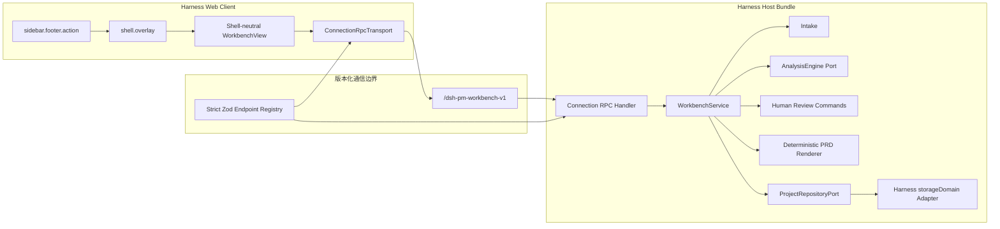

# DSH PM Workbench v0.1：Connection RPC 与 Evidence Core 设计规格

- **日期：** 2026-09-02
- **设计选择：** 已由 owner 批准采用方案 A：Connection RPC、双端严格 schema、`WorkbenchTransport` 迁移缝。
- **文档状态：** 架构规格已于 2026-09-02 获 owner 批准；实施计划待 owner 审阅。批准本规格不构成功能开发、依赖安装、Harness 运行、合并或发布授权。
- **目标宿主：** 本机 DeepSeek Harness `0.1.0-rc.6` Developer Preview。
- **产品形态：** 一个可独立安装的 Bundle，内部为模块化单体。
- **数据边界：** Gate D 之前只允许合成、无身份信息的 TXT / Markdown fixture。
- **现有涟漪主题：** 保持独立安装、独立开关和独立数据，不合并进本插件。

## 1. 决策范围

### 1.1 本次已决定

1. 第一版保持一个安装包，不拆成多个彼此依赖的业务插件。
2. 停止把 generated Typert Remote 当作 v0.1 的必选 Host ↔ Client 通道。
3. 候选替代通道为 `@deepseek-ai/dsh-client-connection@0.1.0-rc.6` 暴露的公共 Connection RPC：
   - Host：`ctx.connection.rpc.handle(...)`；
   - Client：`ctx.connection.rpc.call(...)`。
4. 插件拥有一份版本化、闭集、严格的共享 Zod 协议；Host 必须重新验证输入和输出。
5. 领域层和 UI 只依赖 `WorkbenchTransport`，不直接依赖 Connection RPC，保留未来迁移到 Typert 或其他 transport 的能力。
6. Harness 集成验证与产品核心验证分成两条独立轨道；任何一条通过都不能冒充另一条已经通过。
7. 第一版产品核心只验证“合成文本证据 → 人工确认需求基线 → 引用式 Markdown PRD”。

### 1.2 本次没有决定

- Connection RPC 组合在第三方 tgz、真实 Host、真实 Client 中一定可用；这必须由 Gate A′ 证明。
- 真实模型、录音、ASR、DOCX、PDF、飞书、Figma、POC 生成已经获准接入。
- `loopback` 等于用户身份认证或足以处理真实敏感访谈。
- 插件已经兼容任何 Harness 版本。
- 当前 Pull Request 可以合并到 `main`。
- 私有仓库可以公开、改许可证或发布 npm 包。

### 1.3 被替代的旧设计

本文件替代旧 v0.1 设计和计划中以下内容：

- “generated Typert Remote 是唯一 Host ↔ Client 边界”；
- `integration/harness-rc6/` 内的 Typert mount 方案；
- Gate A 失败后产品领域核心也必须完全冻结；
- 仓库根目录 `src/` 的目标源码布局；
- 首版即引入通用 `ModuleRegistry`、真实 `RunOrchestrator` 和多个模型调用模块。

旧 Typert 矩阵、失败报告和 Gate A No-Go 结论继续作为历史证据保留。它们否决的是所测版本上的严格生成路线，不是整个 Harness 插件形态。

## 2. 用户问题与第一版终点

AI 产品经理完成访谈后，材料、观察、需求候选、优先级和 PRD 往往散落在文件与聊天中。第一版解决三个责任问题：

1. 一条结论来自哪一份材料、哪个 revision、哪一段原文？
2. 它是 fixture / AI 草稿，还是产品经理已经确认的决定？
3. 上游材料改变后，哪些需求、基线和 PRD 已经过期？

第一版唯一主路径：

```text
合成 TXT / Markdown
→ 不可变 SourceRevision
→ 可回算 EvidenceExcerpt
→ RequirementDraftRevision
→ PriorityProposal
→ 人工 accept / edit / reject / defer / reorder
→ 显式发布 RequirementBaseline
→ 确定性生成带引用的 Markdown PrdRevision
```

第一版完成标准不是“出现一个工作台页面”，而是上述引用、版本、人工 gate、冲突和 stale 关系能够被重算和负向测试。

## 3. 事实状态与声明梯度

| 层级 | 名称 | 本层通过后允许的表述 | 仍不能外推为 |
| --- | --- | --- | --- |
| H0 | Gate A′：Harness 集成探针 | 所测环境下 Connection RPC、最小 UI、synthetic storage 与生命周期探针通过 | AI 工作流可用、通用 Harness 兼容或真实数据安全 |
| P0 | Evidence Core | 纯领域的产品核心原型和 fixture 草稿通过 | 真实 AI 分析或可用 Harness 插件 |
| P1 | Shell-neutral Review UI | 合成数据的人工审阅 UI 原型通过 | 已挂载 Harness、真实 AI 或真实数据产品 |
| H1 | Gate B：DSH Plugin Alpha | 可在精确已测版本和隔离 profile 安装的合成数据 Alpha | 未测版本兼容、生产可用或真实敏感数据支持 |
| M | Gate C：Real Model | 指定受限模型和固定评测集已通过所列模型门槛 | 模型对所有访谈准确或可以处理真实材料 |
| D | Gate D：Real Data | 可在明确授权且符合已验收边界的范围内处理真实材料 | 通用隐私合规、企业部署或安全擦除 |
| E | Gate E：Public Alpha | 可按明确批准的许可证、仓库和发布范围公开 Alpha | DeepSeek 官方、生产就绪或一般安全保证 |

H0、P0 与 P1 可以分别验证；H1 必须同时消费已通过的 P0/P1 结果与 **H1-eligible
accepted H0 evidence**。H0 的 runtime PASS 只表示冻结源码对应的 Gate A′ 四文件
run closure 中 A01–A22 全部通过；它本身不是可供 H1 导入的 accepted evidence。
只有该 closure 之后依次完成第 10.1 节规定的人工脱敏决定、独立授权 sealed handoff
export、确定性 promotion、evidence-only commit，并由 owner 接受该完整 commit SHA，H0
才成为 H1-eligible。M、D、E 各自需要新的授权与证据，并且不能跳级。

F0、P0、P1 与 Gate B 的运行结果都不是自动获准的证据。每个阶段必须先在负责 wrapper
验证 canonical action decision 后封存一个与冻结 source 绑定的完整 run closure。promoter
先在共享 pointer lock 下进行无候选输出 preview，两次内存渲染一致后只输出固定 path/SHA-256
与 `candidateSetSha256`。F0 的 evidence decision 必须绑定该候选；P0 与 P1 的人工
review/sanitization decision 和后续 evidence-write/commit decision 都必须绑定相同候选字节。
Gate B 另有一个 post-preview、pre-output 的 candidate-materialization 决定：renderer 必须在
任何 candidate 目录或文件创建前验证该决定，并把 exact closure、render policy、set hash、
两份候选 bytes 与固定三文件 schema 固化为不可变 candidate receipt。Gate B 后续人工 review
与 evidence-write/commit decision 必须同时绑定 materialization decision/authorization receipt、
candidate receipt 及相同候选字节。
Gate A′ 的候选只能在 sealed handoff 存在后生成，因此其 evidence decision 绑定候选，较早的
sanitization decision 仍直接绑定 pre-export 五字段 closure。write mode 重渲染候选并生成不可变
promotion receipt；同一 source/run/final/report/candidate/receipt 身份必须依次通过无写入
`--check`、staged index blob hash 与 committed blob hash 核对。F0 只追加 canonical ledger
一份文档；P0、P1、Gate A′ 与 Gate B 只生成各自固定 Gate 报告与 ledger 两份文档。
evidence commit 必须只有 frozen source 一个 parent，raw NUL diff 只含对应 regular-file
allowlist，且 commit blobs 与 receipt 完全一致；只有可重算 PASS 且 commit 获 owner 接受时，
才能成为下一阶段输入。

## 4. 总体架构



### 4.1 依赖方向

```text
UI → WorkbenchApi → WorkbenchTransport
                         ↓
                 Connection RPC adapter

Harness adapter → Application → Domain
Storage adapter ───────────────→ Ports
Fixture engine ────────────────→ AnalysisEngine
```

`domain/` 不能导入 React、Harness、Cordis、文件系统、网络、模型 SDK 或数据库。Harness 版本差异只能出现在 `integration/harness-rc6/` 和对应 adapter 中。

### 4.2 实际源码根

所有发布代码位于真实包目录 `packages/workbench/`：

```text
packages/workbench/src/
├── domain/
├── application/
├── modules/
│   ├── intake/
│   ├── analysis/
│   ├── review/
│   └── prd/
├── ports/
├── adapters/
├── integration/
│   └── harness-rc6/
└── client/
```

旧计划中的仓库根 `src/` 不再有效。测试与 fixture 位于仓库根 `tests/` 和 `fixtures/`，构建与 tgz 必须只消费 `packages/workbench` 的正式入口和明确允许的共享文件。

## 5. Host ↔ Client 通信契约

### 5.1 TransportPort

UI 和应用层只面向：

```ts
interface WorkbenchTransport<R> {
  request<E extends Extract<keyof R, string>>(
    endpoint: E,
    input: InputOf<R, E>,
    signal?: AbortSignal,
  ): Promise<WorkbenchTransportResult<OutputOf<R, E>>>
}

type WorkbenchTransportResult<T> =
  | { transport: 'connected'; outcome: WorkbenchOutcome<T> }
  | {
      transport: 'failed'
      error: {
        code:
          | 'host-unavailable'
          | 'cancelled'
          | 'protocol-invalid'
          | 'transport-internal'
        incidentId?: string
      }
    }

interface ProbeEndpointTypes {
  health: { input: HealthInput; output: ProbeHealthOutput }
  'counter.increment': {
    input: IncrementCounterInput
    output: IncrementCounterOutput
  }
}

interface ProductEndpointTypes {
  health: { input: HealthInput; output: ProductHealthOutput }
  'projects.list': {
    input: ListProjectsInput
    output: ProjectSummaryPage
  }
  'projects.get': { input: GetProjectInput; output: ProjectOverview }
  'projects.readCollection': {
    input: ReadProjectCollectionInput
    output: ProjectCollectionPage
  }
  'sources.getRevision': {
    input: GetSourceRevisionInput
    output: SourceRevisionMetadata
  }
  'sources.readSegments': {
    input: ReadSourceSegmentsInput
    output: SourceSegmentPage
  }
  'projects.command': {
    input: ExecuteProjectCommandInput
    output: ProjectCommandOutput
  }
  'artifacts.getMarkdownManifest': {
    input: GetMarkdownManifestInput
    output: MarkdownManifest
  }
  'artifacts.readMarkdownChunk': {
    input: ReadMarkdownChunkInput
    output: MarkdownChunk
  }
}

type InputOf<R, E extends keyof R> =
  R[E] extends { input: infer I } ? I : never
type OutputOf<R, E extends keyof R> =
  R[E] extends { output: infer O } ? O : never

type ProbeTransport = WorkbenchTransport<ProbeEndpointTypes>
type ProductTransport = WorkbenchTransport<ProductEndpointTypes>
```

第一版 adapter 为 `ConnectionRpcTransport`。它负责解析 Connection 外层
`RpcResult`，并向 UI 返回总是可判别的 `WorkbenchTransportResult`。无法到达
Host、用户取消、协议 envelope 非法和 adapter 内部异常都必须被 adapter catch
并归一成 `transport: 'failed'`，不能把任意 promise rejection 直接交给 UI。
安全结果不得包含 raw cause、response body、`Error.message` 或 stack；Client
只能根据闭集 code 和可选 opaque incident id 展示预先定义的文案。未来可能新增 `TypertRemoteTransport` 或测试用
`InProcessTransport`，但不能因此改变业务对象或命令语义。Probe 和 Product
分别编译自己的 registry、transport alias、Host handler 与 Client adapter；不得
把二者合并成一个包含两阶段 endpoint 或 output union 的运行时/编译时总表。

### 5.2 Channel 与 endpoint

- 独占 channel：`/dsh-pm-workbench-v1`；
- authority：Gate A′ 仅允许 `loopback`；
- 不拦截共享 `/api`；
- endpoint 是编译时闭集；
- endpoint 名称、输入 schema、输出 schema、大小限制和敏感级别放在同一 registry；
- 未知 endpoint 一律失败，不能动态反射到任意 service 方法。

Gate A′ 只允许：

```text
health
counter.increment
```

`health` 返回固定能力与版本，不读取真实数据。`counter.increment` 只保存合成整数，用于证明写入、CAS、重启和卸载边界。

探针 payload 固定为：

```ts
type HealthInput = Record<string, never>

interface ProbeHealthOutput {
  mode: 'gate-a-probe'
  capabilities: ProbeCapabilities
  counter: number
  aggregateVersion: number
}

interface ProductHealthOutput {
  mode: 'product-alpha'
  capabilities: ProductCapabilities
}

interface IncrementCounterInput {
  apiVersion: 'pmwb-v1'
  expectedVersion: number
  commandId: string
  delta: 1
}

interface IncrementCounterOutput {
  counter: number
  aggregateVersion: number
}
```

`commandId` 必须是 canonical lowercase RFC 4122 UUID v4：36 个 ASCII 字符、
固定连字符位置、version nibble 为 `4`、variant 为 `8/9/a/b`。拒绝空白、
Unicode、路径分隔符和非规范大小写；不得编码用户名、路径或业务正文。
counter 和 version 必须是非负安全整数；只允许 `delta: 1`，不把探针扩展成通用
存储或任意 patch 接口。

Gate A′ 的 `health` variant 同时返回当前 counter 和 aggregate version，因此它是 Gate A′ 唯一的
权威只读 snapshot。写入响应丢失时，Client 可以先调用 `health` 对账，也可以用
完全相同的 `commandId` 和 payload 重放 `counter.increment`；不增加 receipt 或
任意读写 endpoint。

H1 的闭集产品 endpoint 为：

| Endpoint | 输入 | 输出 | 写入要求 |
| --- | --- | --- | --- |
| `health` | 严格空对象 | `ProductHealthOutput`；H1 不接受 probe variant | 只读 |
| `projects.list` | `apiVersion`、首屏或绑定 catalog snapshot 的 continuation、`limit` | 有界 `ProjectSummaryPage` | 只读 |
| `projects.get` | `apiVersion`、`projectId` | 不含大正文的 `ProjectOverview` | 只读 |
| `projects.readCollection` | `apiVersion`、`projectId`、`snapshotVersion`、闭集 `kind`、continuation、`limit` | 同 project、kind、snapshot 的有界 `ProjectCollectionPage` | 只读 |
| `sources.getRevision` | `apiVersion`、`projectId`、`sourceRevisionId` | 不含正文/segments 的 `SourceRevisionMetadata` | 只读 |
| `sources.readSegments` | revision identity、content hash、公开 expected start、opaque cursor、`limit` | 有界、连续的 `SourceSegmentPage` | 只读 |
| `projects.command` | `apiVersion`、`projectId`、`expectedVersion`、`commandId`、闭集 command payload | 紧凑 `ProjectCommandOutput`，只含 commit versions 与 project-owned refs | CAS + receipt |
| `artifacts.getMarkdownManifest` | `apiVersion`、`projectId`、`prdRevisionId` | 不含正文的导出 manifest | 只读 |
| `artifacts.readMarkdownChunk` | artifact identity、content hash、公开 expected start、opaque cursor、chunk byte limit | 有界 `MarkdownChunk` | 只读；不能传目标路径 |

```ts
type ListProjectsInput =
  | {
      apiVersion: 'pmwb-v1'
      continuation?: never
      snapshotVersion?: never
      limit: number
    }
  | {
      apiVersion: 'pmwb-v1'
      continuation: ProjectListContinuation
      snapshotVersion: number
      limit: number
    }

interface ProjectListContinuation {
  cursor: string
  afterProjectId: ProjectId
}

interface GetProjectInput {
  apiVersion: 'pmwb-v1'
  projectId: ProjectId
}

interface ReadProjectCollectionInput {
  apiVersion: 'pmwb-v1'
  projectId: ProjectId
  snapshotVersion: number
  kind:
    | 'analysis-draft'
    | 'evidence'
    | 'requirement'
    | 'priority-proposal'
    | 'decision'
    | 'baseline'
    | 'prd'
  continuation?: EntityPageContinuation
  limit: number
}

interface EntityPageContinuation {
  cursor: string
  afterEntityId: string
}

interface GetSourceRevisionInput {
  apiVersion: 'pmwb-v1'
  projectId: ProjectId
  sourceRevisionId: SourceRevisionId
}

type ReadSourceSegmentsInput = {
  apiVersion: 'pmwb-v1'
  projectId: ProjectId
  sourceRevisionId: SourceRevisionId
  contentHash: Sha256
  limit: number
} & (
  | { cursor?: never; expectedStartIndex: 0; expectedStartOffset: 0 }
  | {
      cursor: string
      expectedStartIndex: number
      expectedStartOffset: number
    }
)

interface ExecuteProjectCommandInput
  extends ProjectCommand<WorkbenchCommandPayload> {
  apiVersion: 'pmwb-v1'
}

type WorkbenchCommandPayload =
  | { type: 'project.create'; title: string }
  | {
      type: 'source.importText'
      sourceId: SourceId
      displayName: string
      format: 'text/plain' | 'text/markdown'
      text: string
    }
  | {
      type: 'analysis.createFixtureDraft'
      sourceRevisionIds: readonly SourceRevisionId[]
    }
  | RequirementDecisionPayload
  | {
      type: 'requirements.reorder'
      orderedRequirementRevisionIds: readonly RequirementRevisionId[]
    }
  | {
      type: 'baseline.publish'
      orderedDecisionIds: readonly HumanDecisionId[]
    }
  | { type: 'prd.render'; baselineId: RequirementBaselineId }

type RequirementDecisionPayload =
  | {
      type: 'requirement.decide'
      requirementRevisionId: RequirementRevisionId
      decision: 'accept'
      reason?: string
      editedRequirement?: never
    }
  | {
      type: 'requirement.decide'
      requirementRevisionId: RequirementRevisionId
      decision: 'edit'
      reason: string
      editedRequirement: HumanRequirementDraft
    }
  | {
      type: 'requirement.decide'
      requirementRevisionId: RequirementRevisionId
      decision: 'reject' | 'defer'
      reason: string
      editedRequirement?: never
    }

interface GetMarkdownManifestInput {
  apiVersion: 'pmwb-v1'
  projectId: ProjectId
  prdRevisionId: PrdRevisionId
}

type ReadMarkdownChunkInput = GetMarkdownManifestInput & {
  contentHash: Sha256
  maxUtf8Bytes: number
} & (
  | { cursor?: never; expectedStartUtf8Byte: 0 }
  | { cursor: string; expectedStartUtf8Byte: number }
)

interface MarkdownManifest {
  projectId: ProjectId
  prdRevisionId: PrdRevisionId
  suggestedFilename: string
  mediaType: 'text/markdown; charset=utf-8'
  contentHash: Sha256
  totalUtf8Bytes: number
}

interface MarkdownChunk {
  projectId: ProjectId
  prdRevisionId: PrdRevisionId
  contentHash: Sha256
  totalUtf8Bytes: number
  startUtf8Byte: number
  endUtf8Byte: number
  utf8Text: string
  chunkHash: Sha256
  next?: {
    cursor: string
    expectedStartUtf8Byte: number
  }
}

interface ProjectSummary {
  projectId: ProjectId
  title: string
  aggregateVersion: number
  sourceCount: number
  currentBaselineId?: RequirementBaselineId
  currentPrdRevisionId?: PrdRevisionId
}

interface ProjectSummaryPage {
  snapshotVersion: number
  startAfterProjectId?: ProjectId
  items: readonly ProjectSummary[]
  next?: ProjectListContinuation
}

interface ProjectOverview {
  projectId: ProjectId
  title: string
  aggregateVersion: number
  sources: readonly SourceRecord[]
  current: CurrentRevisionHeads
  counts: {
    analysisDrafts: number
    evidence: number
    requirements: number
    priorityProposals: number
    decisions: number
    baselines: number
    prds: number
  }
}

interface CurrentRevisionHeads {
  sourceHeads: readonly {
    sourceId: SourceId
    sourceRevisionId: SourceRevisionId
  }[]
  analysisDraftRevisionId?: AnalysisDraftRevisionId
  baselineId?: RequirementBaselineId
  prdRevisionId?: PrdRevisionId
}

interface CollectionPage<K extends string, T> {
  projectId: ProjectId
  kind: K
  snapshotVersion: number
  startAfterEntityId?: string
  items: readonly T[]
  next?: EntityPageContinuation
}

type ProjectCollectionPage =
  | CollectionPage<'analysis-draft', AnalysisDraftRevision>
  | CollectionPage<'evidence', EvidenceExcerpt>
  | CollectionPage<'requirement', RequirementDraftRevision>
  | CollectionPage<'priority-proposal', PriorityProposal>
  | CollectionPage<'decision', HumanDecision>
  | CollectionPage<'baseline', RequirementBaseline>
  | CollectionPage<'prd', PrdSummary>

interface PrdSummary {
  id: PrdRevisionId
  baselineId: RequirementBaselineId
  contentHash: Sha256
  totalUtf8Bytes: number
  rendererVersion: string
}

interface SourceRevisionMetadata {
  projectId: ProjectId
  sourceId: SourceId
  sourceRevisionId: SourceRevisionId
  displayName: string
  format: 'text/plain' | 'text/markdown'
  contentHash: Sha256
  normalizedUtf8Bytes: number
  normalizedUtf16CodeUnits: number
  segmentCount: number
}

interface SourceSegmentView {
  segmentId: SegmentId
  index: number
  startOffset: number
  endOffset: number
  text: string
  textUtf8Bytes: number
  textHash: Sha256
}

interface SourceSegmentPage {
  projectId: ProjectId
  sourceRevisionId: SourceRevisionId
  contentHash: Sha256
  normalizedUtf8Bytes: number
  normalizedUtf16CodeUnits: number
  segmentCount: number
  startIndex: number
  startOffset: number
  endIndexExclusive: number
  endOffset: number
  items: readonly SourceSegmentView[]
  next?: {
    cursor: string
    expectedStartIndex: number
    expectedStartOffset: number
  }
}

interface EntityRef {
  projectId: ProjectId
  kind:
    | 'project'
    | 'source-revision'
    | 'analysis-draft'
    | 'evidence'
    | 'requirement'
    | 'priority-proposal'
    | 'decision'
    | 'baseline'
    | 'prd'
  id: string
}

interface ProjectCommandOutput {
  projectId: ProjectId
  committedVersion: number
  catalogVersionAtCommit: number
  created: readonly EntityRef[]
  changed: readonly EntityRef[]
}
```

`ProjectCommandOutput` 是某次 commit 的确认凭据，不是 current project snapshot。
每个 `EntityRef.projectId` 必须等于 command request 的 project；Client 可以纯函数
校验 owner。accepted command（包括 receipt replay）之后，Client 必须另调
`projects.get` 取得当前权威 overview。UI 对每个 project 保存最高已观察
`aggregateVersion`，较低 version 只能确认历史 command，绝不能覆盖、回退或启动
新的分页；`catalogVersionAtCommit` 同样不能回退已知 catalog snapshot。

`ProjectSummaryPage` 是有界、稳定排序的 project id/title/version 列表。
Host 持久化一个非负安全整数 `catalogVersion`；任何会改变 project list 中可见
字段的 commit 都在同一事务中递增它。首屏省略 continuation/snapshot，响应返回当前
`snapshotVersion = catalogVersion`；后续页必须回传 snapshot 与完整
`ProjectListContinuation`。如果当前 catalog
version 已改变，Host 返回 `stale-input`，Client 丢弃已拼接页面并从首屏重启，
不混合两个版本。

`projects.readCollection` 的 `snapshotVersion` 来自 `projects.get` 返回的
`aggregateVersion`。每一页都回显同一 version；分页期间 aggregate 变化时返回
`stale-input`，不保留旧 snapshot。Client 同样丢弃部分集合、刷新 overview 后
从第一页重读。`ProjectOverview` 不含正文或无限集合；collection wire view
不得携带 source 正文，`PrdSummary` 不携带 Markdown。

首屏 page 的 `startAfter*` 必须省略；后续 page 必须精确回显 input continuation
的公开 `after*`。items 按 id 严格递增且不重复；`next` 只在仍有数据时出现，其
公开 `after*` 必须等于本页最后一个 item id。Source page 的 start index/offset
必须等于 input expected 值，end 必须等于逐项验证后的末端；Markdown chunk 的
start 必须等于 input expected byte，`next` 的 expected start 必须等于本页 end。
空 page/chunk 不能携带 `next`，也不能用来制造不前进的循环。

cursor 只由 Host 产生、最长 512 个 ASCII base64url 字符，解码后是 strict、
versioned、无路径的 canonical payload，绑定 endpoint、project/catalog、kind、
snapshot version 与下一排序键，并附带 HMAC-SHA-256 tag。profile 首次进入 H1
时生成 256-bit 随机 signing key，保存在插件私有 storageDomain；不得返回 Client、
写日志或进入导出。Host 把 cursor 当不可信输入：tag 不匹配、字段不匹配、未知
版本、越界/不存在的排序键或非 canonical 编码都返回 `invalid-input`，不读取其他
project。这个 HMAC 只防止 Client 意外/任意改写 cursor，不是用户认证；同一
macOS 用户下进程仍属于第 5.7 节接受的本机信任边界。读取
顺序由 Host 固定为 immutable id 的全序。只要 snapshot 未变化，连续使用 Host
返回的 cursor 必须无漏项、无重复；snapshot 变化则只允许上述 fail/restart。

opaque cursor 的 HMAC 和内部绑定只由 Host 验证，Client 不持有 signing key，也
不得声称能验证 tag。wire 同时携带公开 continuation metadata：project list 的
`afterProjectId`、collection 的 `afterEntityId`、source 的 expected next
index/offset、Markdown 的 expected next UTF-8 byte。Client facade 把上一页公开
`next` 原样放入下一次 input，并在 `ReadValidationContext` 中保存 snapshot、
已见 ID、expected index/offset 和 manifest。它可验证排序、去重、公开连续性、
identity 与 hash；若 Host 返回的 opaque `next.cursor` tag 错误，只能在下一次
Host 校验时发现。此时 facade 必须丢弃未完成的聚合读取并显示协议错误，不能把
部分集合/正文/下载标成完整。

Source revision 与 PRD revision 都不可变。`sources.getRevision` 只返回 metadata；
完整规范化原文由 `sources.readSegments` 按 segment 顺序读出，cursor 绑定
project、revision、content hash 与公开 expected next index/offset。segments 必须无缝、无重叠地覆盖
正文，Client 拼接后复算总 bytes 和 content hash。Markdown 先读取 manifest，
再按 UTF-8 scalar boundary 读取 chunks；input 显式携带 expected start byte，
每块验证 identity、offset、`chunkHash`，
全部拼接后验证 total bytes 与 manifest `contentHash`，通过前不生成下载。任一
关联、顺序、hash 或最终长度不符都 fail closed 为 `protocol-invalid`。

`project.create` 使用 Client 预先生成的 `projectId`、`expectedVersion: 0` 和
UUID `commandId`；只有 project 不存在时才能 accepted。这样创建请求丢失后可
用同一 project/command id 安全重放，不需要全局可变“最后创建项目”状态。

Gate A′ 的 runtime registry 只有 `health` 和 `counter.increment`。进入 H1 时，
整个 `ProbeEndpointTypes`、`ProbeHealthOutput`、probe handler 与 probe adapter
必须从产品构建产物删除，并只编译上述九个 `ProductEndpointTypes` endpoint；
相关 schema、unknown-endpoint、生命周期和真实 tarball 测试必须重跑。Gate A′
的 probe endpoint 不能作为隐藏的生产后门继续存在。

### 5.3 版本握手

必须分开记录：

```ts
interface CapabilityBase {
  apiVersion: 'pmwb-v1'
  wireSchemaVersion: '1'
  dataSchemaVersion: '1'
  pluginVersion: string
  harnessTarget: '0.1.0-rc.6'
  maxRpcPayloadUtf8Bytes: number
  maxTextUtf8Bytes: number
  maxReadPageUtf8Bytes: number
  maxCommandReceiptsPerAggregate: number
  maxReceiptLedgerPersistedBytes: number
  maxClientInflightRequests: 8
  maxHostInflightRequests: 16
}

interface ProbeCapabilities extends CapabilityBase {
  supportedFeatures: readonly ['health', 'synthetic-counter']
  storage: 'synthetic-counter-only'
  analysis: 'none'
}

interface ProductCapabilities extends CapabilityBase {
  supportedFeatures: readonly [
    'chunked-read',
    'evidence-core',
    'health',
    'markdown-export',
    'snapshot-pagination',
  ]
  storage: 'project-domain'
  analysis: 'fixture'
  maxProjectPersistedBytes: number
  maxProfilePersistedBytes: number
  maxTransactionTemporaryBytes: number
}

type WorkbenchFeature =
  | 'chunked-read'
  | 'health'
  | 'synthetic-counter'
  | 'evidence-core'
  | 'markdown-export'
  | 'snapshot-pagination'
```

`supportedFeatures` 属于上述闭集，必须去重并按字典序排序。Probe 与 Product
分别使用精确 tuple：Gate A′ 只能返回 `['health', 'synthetic-counter']`；H1
只能返回 `['chunked-read', 'evidence-core', 'health', 'markdown-export',
'snapshot-pagination']`。两阶段 capability schema 不接受对方的 storage、
analysis 或 feature 组合，不能用任意字符串触发 Client 行为。

Gate A′ 的 `maxRpcPayloadUtf8Bytes/maxTextUtf8Bytes/maxReadPageUtf8Bytes` 精确为
`4_096/0/4_096`；H1 精确为 `2_883_584/1_048_576/786_432`。Client 必须把
这些值与本地当前阶段 schema 的常量逐项比较；Host 返回更宽或更窄的值都视为
协议不兼容，而不是静默选择其中一个。

Gate A′ 的 receipt count/ledger bytes 精确为 `256/1_048_576`；H1 精确为
`2_048/8_388_608`。H1 另返回 project/profile/transaction temporary bytes：
`67_108_864/536_870_912/75_497_472`。这些同样是 schema 中的精确常量，不能只
显示在 UI 文案或依赖默认配置。

Client 必须先完成 `health` 握手。Host 不可达时显示“工作台 Host 未就绪”，
不能展示一个容易被误认成真实状态的空项目，也不能无限快速重试。Client 遇到
不支持的 `apiVersion`、`wireSchemaVersion` 或 `dataSchemaVersion` 时必须停止写入并显示兼容性错误，
不能猜测降级。

### 5.4 双端 schema 校验

1. Client 在发送前验证 input 和 canonical plugin request 的 byte budget。
2. Host 使用 `Map` 或 `Object.hasOwn()` 查找闭集 endpoint，不能对普通对象做不安全的动态属性访问。
3. Host 收到 `unknown` 后重新验证 input。
4. Host 执行应用服务并重新检查领域 invariant。
5. Host service 返回后验证 output、input/output 关联、JSON 可表示性和 canonical plugin outcome 的 byte budget。
6. Client 先解析 Connection 外层 `RpcResult`，再调用当前阶段、当前 endpoint 的 `validateOutput(input, output, context)`；失败时 fail closed，不能局部渲染。
7. 所有对象使用严格模式，拒绝未知字段。
8. 数字必须有限；版本、offset、rank、size 使用安全整数约束。
9. Wire 数据只允许无损 JSON：禁止 `undefined`、`NaN`、`Infinity`、`BigInt`、`Date` 实例、`Map`、class instance、函数和循环引用；时间使用规范 UTC 字符串。
10. 字符串和集合使用第 5.8 节的明确上限；Gate A′ 不接受任何访谈正文。
11. schema 失败只返回稳定错误 code、字段路径和安全摘要，不回显 received value 或完整 payload。

registry 的每个条目必须同时拥有共享的 `inputSchema`、`outputSchema`、
`validateOutput(input, output, context)`、plugin request/outcome byte budget 与
敏感级别；不能只按
静态 output shape 校验。对 accepted output，至少验证：

- `projects.get` 与 `projects.command` 的 `projectId` 等于 request；accepted
  mutation 的 version 与该命令允许的 version transition 一致；
- collection page 的 project、kind、snapshot version、公开 continuation 和
  `context.seenIds` 与 request 一致；project list 的 catalog snapshot 一致；
- source metadata/page 的 project、revision、content hash、segment index/offset
  连续且属于所请求 source；
- Markdown manifest/chunk 的 project、PRD、content hash、offset、chunk hash 与
  request 一致，Client 在下载前再校验完整拼接 hash；
- 每个返回 ref 的 `projectId` 等于 request project，且 kind 与命令语义一致。

`ReadValidationContext` 是 Client facade 的非 wire 状态：

```ts
interface ReadValidationContext {
  projectId?: ProjectId
  kind?: ReadProjectCollectionInput['kind']
  snapshotVersion?: number
  contentHash?: Sha256
  seenIds: ReadonlySet<string>
  expectedStartIndex?: number
  expectedStartOffset?: number
  expectedStartUtf8Byte?: number
  manifest?: MarkdownManifest
}
```

它保存当前读取的 snapshot/content identity、已见 IDs、上一页公开 next
index/offset 与 Markdown manifest；关闭/取消读取时清空。Host 使用同一关联规则
加权威 repository context，并额外验证 cursor HMAC。Client 只检查 opaque cursor
的 schema/长度及公开 continuation，不能验证 HMAC authenticity。

负向 contract tests 必须分别注入“shape 合法但 project/kind/revision/hash/offset、
公开 continuation 或 ref owner 错误”的 Host 响应，并证明 Client 返回
`protocol-invalid`、不渲染完整结果、不下载、不自动重试。随机或错误 tag 的
opaque `next.cursor` 在下一页由 Host 拒绝，Client 随即丢弃未完成聚合读取。
`WorkbenchOutcome` 为 rejected 时只接受闭集错误 schema，不运行 accepted-value
的关联检查。

### 5.5 错误语义

Connection 已定义外层 transport `RpcResult`，插件不能向它伪造新的 Harness
错误码。可预期业务拒绝使用内层判别式 union：

```ts
type WorkbenchErrorCode =
  | 'invalid-input'
  | 'source-too-large'
  | 'limit-exceeded'
  | 'version-conflict'
  | 'idempotency-key-reused'
  | 'stale-input'
  | 'not-found'
  | 'invalid-transition'
  | 'unsupported-schema'

type WorkbenchErrorMessageKey = `workbench.error.${WorkbenchErrorCode}`

type WorkbenchOutcome<T> =
  | { status: 'accepted'; value: T }
  | {
      status: 'rejected'
      error: {
        code: WorkbenchErrorCode
        messageKey: WorkbenchErrorMessageKey
      }
    }

type WireResult<T> = RpcResult<WorkbenchOutcome<T>>
```

HTTP、Connection envelope、取消和 Host 基础设施故障属于外层
`RpcResult`；版本冲突、项目不存在、状态不允许和 stale 等属于内层
`WorkbenchOutcome`。插件 Host handler 主动返回的外层错误只允许目标 rc.6
已经定义的 `bad-request`、`cancelled` 和 `internal`：未知 endpoint 或无法形成
合法 input 使用 `bad-request`；提交前生效的 abort 使用 `cancelled`；未预期
基础设施故障使用 `internal`。Client 收到其他 outer code 时归一为
`protocol-invalid` 或 `transport-internal`，不显示其原始 message/details。
`internal` 只返回固定通用文本和非敏感 incident id。

错误映射是共享的闭集常量，不由单个 handler 或 UI 自行决定：

| 来源 | Client 结果 | 自动重试 |
| --- | --- | --- |
| Connection `bad-request` | `protocol-invalid` | 禁止 |
| Connection `cancelled` | `cancelled` | 禁止；先按第 5.6 节判断结果是否未知 |
| Connection `internal` | `transport-internal` | 禁止；mutation 先用同一 command 对账 |
| 不可达、断连、超时 | `host-unavailable` | 只读可退避重试；mutation 禁止换 ID |
| 未知 outer code / 非法 envelope | `protocol-invalid` | 禁止 |
| 任一 `WorkbenchErrorCode` | 保留该内层 code | 禁止自动重试 |

`version-conflict` / `stale-input` 只允许刷新权威 snapshot 后由用户重新确认；若
形成新的写意图，使用基于新 version 的新 command。只有“提交结果未知”的同一
写意图可以复用完全相同的 endpoint、`commandId` 与 payload 对账；任何 adapter
都不得改变 payload 后沿用旧 ID，或用新 ID 自动重放 mutation。

`WorkbenchErrorMessageKey` 与业务 error code 一一对应，Client 从本地闭集文案
表取显示文本。禁止在 Host 拼接 payload、项目标题、正文、路径、
`Error.message` 或 provider 内容形成消息。

adapter 必须捕获基础设施异常并映射为脱敏 transport error。任何响应、日志或 UI 错误中都不得出现：

- 原始 payload；
- source 正文或 quote；
- API key、cookie、token；
- 本机绝对路径；
- stack trace；
- storageDomain 的物理位置。

Connection 的通用 handler 可能把未捕获异常转换为包含
`String(error)` 的 handler-failure 响应。插件 Host dispatcher 因此必须在
边界内 catch all，先完成安全错误映射与输出 schema 校验，再始终 resolve
一个符合 Connection `RpcResult` 结构的结果。业务代码、schema 错误和 adapter
异常都不能穿过 handler 成为未捕获异常。Gate A′ 必须使用带 canary 正文、
绝对路径和伪 token 的故障，扫描原始 HTTP response body、Host stdout/stderr、
隔离 profile 日志、浏览器 console 和 Client 展示，
证明这些内容没有泄露。

### 5.6 取消与生命周期

- Client 的 `AbortSignal` 必须传到 Host，并允许尚未开始提交的工作尽早停止；
- Host handler 必须向下传递 signal；
- 注册返回的 disposer 必须由调用方 Cordis fiber 持有；
- 重复 mount 不得遗留旧 channel；
- 插件 remove 后重启，channel、launcher 和 overlay 必须消失；
- Gate A′ 不增加自定义 event 或长任务；
- 未来长任务只通过 `startRun / getRun / cancelRun` 与有界轮询进入设计，不能把聊天输出抓成结构化结果。

Host 释放顺序固定为：

```text
进入 draining 并拒绝新业务命令
→ 注销 Connection channel
→ 触发插件生命周期 AbortController
→ 等待在途 handler 到达原子写入前或后的安全终点
→ 将未来未完成 Run 标记为 interrupted
→ 排空已入队 storageDomain 写入
→ await Domain.close()
→ 释放其他监听和资源
```

Client 先撤销 slot，再 abort 当前读取与轮询，移除 focus、keydown、resize 等
监听并清除临时内存状态。组件 contract tests 必须直接驱动 Cordis disposer/remount hooks，
覆盖 disable/enable 与 unload/reload 等效生命周期；真实 Gate 只声明 exact rc.6 public surface
能够驱动并已冻结的动作。本版真实 profile 图使用 remove/re-add 加 restart/remount，不能把它
重命名成“插件保持安装但 disabled/enabled”。两类证据都不得产生重复按钮、重复 channel、
旧监听或 Domain close 后的异步写入。

有先后依赖的 Host 资源必须由一个 lifecycle coordinator 或单一 async disposer
按上述顺序释放，不能只因为多个 effect 属于同一个 Cordis fiber 就推断清理顺序。
Gate A′ 必须观察 route 注销、handler drain 和 Domain close 的真实先后关系。

对 `counter.increment`，Host 必须在一次原子写入中完成 version 检查、幂等记录
和 counter 更新。Host 在入队前检查合并后的 signal；获得项目串行锁后、查询
receipt/CAS/持久化之前必须再次检查；H1 获得全局 catalog commit coordinator
后、写 fixed pending intent 前再检查一次。任一 pre-intent 检查发现 abort 时，不执行
CAS、不写 intent、snapshot 或 receipt，并返回安全的 `cancelled`。Gate A′ 单记录
CAS commit 一旦开始就完整完成并写入 command receipt；H1 intent 一旦写入则必须
完成或由 recovery 收敛到完整旧/新版，并按第 5.8 节同步清理后才返回 accepted，不能
在中途暴露半条记录。若 signal
在入队前或排队等待时中止，状态不能改变；若 commit 已开始或已完成但响应丢失，Client 必须显示
“结果未知”，并以同一 `commandId` 查询 receipt 或权威 snapshot，不能换一个
commandId 盲目重试。测试需覆盖这两个时序，不能把“请求被取消”直接等同于
“写入一定没有发生”。关闭 overlay 只终止 UI 请求和轮询；未来取消持久 Run
必须通过显式 `cancelRun` 命令。

幂等身份是 `(projectId, commandId)`。判断顺序固定为：定位 aggregate 后，先在
原子临界区按 `commandId` 查 receipt；若存在且
canonical request hash 相同，返回第一次存储的 outcome，不再检查已变化的
`expectedVersion`；若同一 id 携带不同 endpoint 或 payload，返回不可重试的
`idempotency-key-reused` 并保留原 receipt；只有没有 receipt 时才检查容量、
`expectedVersion` 和领域条件并提交。
request hash 为 endpoint 与去掉 `commandId` 后严格 input 的 canonical JSON
SHA-256。receipt 在所属 aggregate 存续期间不能被静默淘汰；达到上限时拒绝
新 mutation，不能牺牲幂等保证继续写入。

“receipt-eligible” 精确定义为：input 已通过 schema；目标 aggregate 已存在；
`commandId` 在该 ledger 中尚未使用；ledger 仍有容量；且请求已经进入 CAS / 领域
判断。所有 receipt-eligible mutation，无论 accepted，还是 `version-conflict`、
`stale-input`、`invalid-transition` 等业务 rejected，都持久化第一次终态 outcome。
rejected receipt 不增加 aggregate version，但和 accepted receipt 一样持久化。
accepted receipt 只保存紧凑 `ProjectCommandOutput`，不保存 `ProjectOverview`、正文
或 Markdown；单 receipt 和 ledger 同时受第 5.8 节 byte quota。

以下前置拒绝不创建新 receipt，不能被文档或测试概括成“所有业务错误都有
receipt”：

- schema / api version 无法形成合法命令，或 `commandId` 无法解析；
- `source.importText` 规范化后的内容 hash 不在 owner 已接受的固定合成 fixture
  revision 集合中；该检查必须发生在创建/修改任何 project、source、receipt 或
  version 之前，并固定返回不回显内容的 `invalid-input`；
- 非 create 命令的目标 project 不存在，返回 `not-found`；
- `project.create` 因 project 总数已满而返回 `limit-exceeded`；
- projected receipt-ledger、project、profile 或事务临时空间 quota 已满而返回
  `limit-exceeded`；
- 同一 `(projectId, commandId)` 已存在但 request hash 不同，返回
  `idempotency-key-reused` 并保留原 receipt；
- ledger 已满时的新 ID，返回 `limit-exceeded`；
- transport/internal failure，或 commit 前生效的 abort。

这些结果是当次调用的安全终态，但除“原 receipt 被保留”和“ledger 仍饱和”外，
不承诺跨状态变化重放仍返回同一结果；Client 禁止自动重试。Gate A′ 的 synthetic
aggregate 启动时即存在。H1 的 `project.create` 在 project 尚不存在时，以单一
原子 commit 同时创建 aggregate、递增 `catalogVersion` 并写入该 project 的第一
条 receipt；重放时先从已创建 project 的 ledger 命中原 outcome。若 project 已
存在而 ID 尚未使用，则在该 project ledger 有容量时记录相应 rejected outcome。

receipt 容量已满时，只要 ledger 仍满，同一新请求都确定性地得到
`limit-exceeded`，且 snapshot/counter/version 不变。只有 purge 整个 aggregate
才解除饱和并删除其 receipts；不承诺 purge 后旧 `commandId` 仍能查询原 outcome。

### 5.7 信任边界

Connection 层提供请求 envelope、关联、取消和 Host / Origin 信任栅栏。`authority: 'loopback'` 只表达本机 authority 策略，不等于用户身份认证，也不证明其他本机进程无法访问端口。

v0.1 的 Host 必须只绑定 `127.0.0.1` / loopback，`trustedHosts` 保持空，
禁止 `authority: 'trusted-host'`、LAN 地址、`0.0.0.0`、反向代理和网络隧道。
插件不提供把该策略切换为 trusted-host 的配置，也不使用 `/api` intercept。
Gate A′ 的临时 profile 若无法证明这一点即为 No-Go。首版显式采用“同一 macOS
用户下的其他进程在本机信任边界内”这一假设；它不适用于多用户共享电脑、
不可信本机进程或远程访问场景。

因此 Gate A′ 只传合成 counter。真实访谈必须等待 Gate D 的本机威胁模型、
认证需求、静态数据保护、备份、数据保留与删除语义通过。若届时不能接受上述
同机进程信任假设，必须增加新的授权边界或更换宿主形态。

Connection 会在插件 handler 之前缓冲并解析 JSON。插件的业务尺寸校验只能在
解析后执行，不能完全防止恶意本机调用者制造瞬时内存压力。这是 v0.1 接受的
本机拒绝服务残余风险，不得写成“payload 上限已完全防御本机 DoS”。

### 5.8 初始容量与并发上限

以下是 v0.1 的 fail-closed 保护值；以后修改需要协议或 data schema 审查。
这里的 request / outcome 指插件可见的 canonical endpoint + payload 或
`WorkbenchOutcome` JSON；二者分开计量 UTF-8 bytes，不能用 JavaScript
`string.length`、文件原始大小或未转义正文代替：

| 项目 | 上限与计量方式 |
| --- | --- |
| Gate A′ plugin request / outcome | 各自 canonical JSON UTF-8 bytes 不超过 `4_096` |
| H1 plugin request / outcome | 各自 canonical JSON UTF-8 bytes 不超过 `2_883_584` |
| 有界 read page / chunk outcome | canonical JSON UTF-8 bytes 不超过 `786_432` |
| 原始 TXT/MD 文件 | Client 解码前 bytes 不超过 `1_048_576` |
| 规范化正文 | UTF-8 bytes 不超过 `1_048_576`，UTF-16 code units 不超过 `500_000` |
| 单个 Markdown PRD | UTF-8 bytes 不超过 `2_097_152`；超限拒绝生成，不截断 |
| segments | 每个 SourceRevision 不超过 `10_000` |
| 单个 SourceSegment 文本 | UTF-8 bytes 不超过 `65_536`；切分不得破坏 Unicode scalar 或 locator |
| 单个 Markdown chunk 文本 | UTF-8 bytes 不超过 `262_144`；按 Unicode scalar boundary 结束 |
| 单个 collection wire item | canonical JSON UTF-8 bytes 不超过 `131_072`；PRD 只返回 summary |
| 单个 SourceSegmentView | canonical JSON UTF-8 bytes 不超过 `196_608` |
| ProjectOverview | canonical JSON UTF-8 bytes 不超过 `524_288` |
| ProjectCommandOutput / 单 receipt | 各自 canonical JSON UTF-8 bytes 不超过 `196_608` |
| 项目标题 | 不超过 120 Unicode code points 且 UTF-8 bytes 不超过 512 |
| participant 假名 | 不超过 80 code points 且 UTF-8 bytes 不超过 320 |
| display name / 建议文件名 | 不超过 200 code points 且 UTF-8 bytes 不超过 1,024；文件名只含安全 basename，不含 `/`、`\\` 或 `..` segment |
| 人工决定理由 | 不超过 2,000 code points 且 UTF-8 bytes 不超过 8,192 |
| 所有其他 string 字段 | 每字段不超过 2,000 code points 且 UTF-8 bytes 不超过 8,192；具体 schema 应取更小值 |
| Evidence quote | 不超过 4,000 code points 且 UTF-8 bytes 不超过 16,384，并受 source slice 约束 |
| ID / hash | 所有 ID 为 canonical lowercase UUID v4（36 ASCII bytes）；SHA-256 为 64 个 lowercase hex 字符 |
| version / incident id / UTC time | version 最多 64 个 ASCII 字符；incident id 最多 64 个 opaque ASCII 字符；时间为 canonical UTC ISO 8601 |
| cursor | 不超过 512 个 ASCII base64url 字符；禁止 padding、路径字符和任意正文 |
| 普通领域数组 | 每字段最多 100 项；schema 明确列出的更小值优先 |
| 排序/发布 ID 数组 | `orderedRequirementRevisionIds`、`orderedDecisionIds` 各最多 1,000 项 |
| command output refs | `created` 与 `changed` 合计最多 1,000 项 |
| profile 内 projects | 最多 100 个；达到上限的 create 是不写 receipt 的前置拒绝 |
| 项目内对象 | SourceRecord 100、SourceRevision 500、AnalysisDraftRevision 500、EvidenceExcerpt 5,000、RequirementDraftRevision 1,000、PriorityProposal 1,000、HumanDecision 5,000、Baseline 200、PRD 200 |
| command receipts | Gate A′ 最多 256；P0/H1 每项目最多 2,048；不自动淘汰 |
| receipt ledger persisted bytes | Gate A′ 最多 `1_048_576`；H1 每项目最多 `8_388_608` |
| project persisted bytes | H1 每项目 canonical persisted encoding 最多 `67_108_864` |
| profile persisted bytes | H1 的 catalog、key、projects 与 receipts 合计最多 `536_870_912` |
| 单次事务临时空间 | 最多为新 affected-project encoding + `8_388_608`，且绝不超过 `75_497_472` |
| Client 并发 | 每个浏览器 adapter 最多 8 个在途请求；仅为体验节流，不是身份或安全边界 |
| Host 并发 | `/dsh-pm-workbench-v1` 全局最多 16 个在途 handler；每项目另有 1 个串行 mutation；未来每项目最多 1 个 active Run |

P0 的 `InProcessTransport` 使用相同 payload schema 和业务容量常量，但它不是
RPC。Client 执行 8 请求本地节流；Host 独立执行全 channel 16 请求的权威上限，
不能尝试按不可认证的 Client 身份计数。第 17 个请求在进入应用 service 前
fail closed 为固定、脱敏的 outer `internal`，且没有 side effect。其他业务
超限返回内层
`limit-exceeded` 或 `source-too-large`，不得截断、抽样后假装完整，或创建半个
revision。`health` 返回实际上限，Client 不能硬编码比 Host 更宽松的值。

Client 的“最多 8 个在途”是可取消的本地队列，不是对第 9 个请求返回业务拒绝：
第 9 个请求在本地等待可用名额，等待期间 abort 返回 transport `cancelled`，且
不得调用 Host。只有绕过 Client 直接制造第 17 个 Host 在途请求时，才由 Host
在 service 前返回上述固定 outer `internal`。

每个已有 project 的 mutation 先进入该 project 的串行队列，再在最终 commit
点进入一个短时全局 catalog commit coordinator；`project.create` 直接进入该
coordinator。锁顺序只能是 project → catalog，任何代码不得反向获取。这样不同
project 可以并行做纯计算，但 project snapshot、receipt、summary 与
`catalogVersion` 的原子可见点全局有序，不会丢失 catalog increment。只读请求
不拿写锁，只根据已经提交的 snapshot/version 校验。

导入文本还必须是有效 UTF-8；规范化到 LF 与 Unicode NFC 后拒绝 NUL、lone
surrogate 及除 tab/newline 外的 C0 control。canonical JSON 只转义 JSON 必需
字符，因此 1 MiB 规范化文本在最坏的引号、反斜线、tab/newline 情况下仍小于
H1 request budget；整个 `source.importText` request 仍要由 Client 与 Host 各自
实测。任一适用上限失败都在 commit 前拒绝。

collection page 同时受 `limit` 与 `786_432` byte budget 约束：按稳定顺序加入
下一 item 会超限时即结束本页并返回 cursor，不允许先序列化超限再截断。每个
可持久化 collection view 都先满足单 item 上限，因此非空剩余集合至少能返回
一项。source segment 与 Markdown chunk 使用相同规则，并分别受自身 decoded
text 上限。所有 page/chunk 在返回前都必须同时满足 `786_432` page/chunk outcome
与 `2_883_584` H1 plugin outcome 上限。

插件看不到 Connection 原始 request bytes、任意空白、外层 `rpcId`，也不能在
handler 内控制 response 对 `rpcId` 的回显，因此**不声明整个 Connection wire
message 有 3 MiB 硬上限**。Client adapter 只能对自己将发送的规范 envelope 做
预算预检；Host 只对解析后的 endpoint/payload 与返回前的 plugin outcome 执行
上述上限。目标 rc.6 的本地源码观察显示 carrier 默认会在 handler 前缓冲最多
`160 * 1024 * 1024` request-body bytes，且 `rpcId` schema 是没有长度上限的
string；Gate A′ 必须在实际 resolved package 上重新记录精确行为。
恶意同机调用者仍可在插件校验前消耗内存，这属于第 5.7 节已接受的 DoS 残余，
不得把业务 budget 写成 carrier 防护证据。

每个 mutation 在原子 commit 前必须构造并验证：command output、更新后的
overview、所有新增/变更实体的 wire view、source metadata/segments，或 PRD
manifest/chunk plan。只要其中任何一个不能通过相应 read endpoint 在上述预算内
完整重组，就返回 `limit-exceeded` / `source-too-large` 且不持久化。这条
read-after-write closure 是领域 invariant；测试必须证明每个 accepted source、
entity 和 PRD 都能逐页/逐块完整读取并复算 hash。

持久化 quota 以 canonical persisted encoding 计量，覆盖当前 head、所有保留的
immutable revisions、catalog、cursor key、receipts、所有 active/inactive staging
generation、固定 prepared intent、待回收 superseded record 与其他插件自有物理记录；
不能只统计逻辑 head 或 wire view。首版只允许一个已知 journal key
`journals/pending-v1`，因为窄 public driver 不依赖 table enumeration。任一 transaction
必须先在内存中分配所有 generation ID，并构造 `PendingIntentV1`：它绑定 transaction、
旧 root identity（首次初始化为 `NO_ROOT_V1`）、完整 target root/hash、每个未来 staging
ref/hash、每个 superseded ref、projected physical bytes 与 prepared 状态。root/catalog
可达记录与该 fixed intent 列出的记录之并集就是可发现、可计量、可清理的物理 inventory；
不得让随机 staging key 只存在于可能丢失的进程内存。

Host 在 catalog commit coordinator 内，先完成业务校验、read-after-write closure，
再计算包含 pending intent、全部 staging、superseded 与整个 profile 的 projected bytes；
任一 count/byte quota 超限都返回 `limit-exceeded`，且不写 intent、receipt、snapshot
或 version。该 quota preflight 属于第 5.6 节“不创建 receipt”的前置拒绝，因为系统
没有安全空间再保存拒绝 outcome。

adapter 的第一个物理写必须是 fixed pending intent，并须 reread/hash 验证；在它成功
之前禁止写任何 project/receipt/catalog staging。随后只可写入 intent 已列出的 staging，
完整 reread 验证后，以单一公开、版本锁定且有明确 crash-atomic 契约的 root replacement
切换可见版本，最后**同步**回收 superseded 与 intent、复核物理计量，成功后才向 Client
返回 accepted。临时写入也受表中 72 MiB 上限；无法取得所需临时空间、Domain quota
或磁盘写入失败时，旧 committed state 必须仍可读，新 snapshot/receipt/version 不可见，
并返回脱敏 outer `internal`。如果 commit marker 是否生效无法确定，或 root 已切换但
cleanup/recount 失败，先进入 `recovery-required`，再返回 outer `internal` 与“结果未知”；
不得先返回 accepted 后后台清理。重启 recovery 必须以 root 的 committedTransactionId
及 fixed intent 的 old/target identity 确定完整旧版或完整新版，再用同一 command 对账；
绝不能拼接两版。

首次初始化也使用同一 fixed intent：在无 root/no intent 状态下先在内存中生成唯一
cursor key、空 catalog 与 target root，完成 quota 后写/reread initialization intent，
再 stage/reread catalog、原子 replace root、同步 cleanup。无 root + valid init intent
在 reopen 时只能完成该 target 或清除 intent 明确列出的不完整 staging 后重试；无 root
+ malformed/mismatched intent、无法验证或无法清理其所列记录时必须 fail closed，禁止
静默 reset 或另建 signing key。实现与测试还必须证明所有 generation write 的唯一入口
都要求 ref 已在 fixed intent 中，因而自身不会产生无法发现的随机 key；没有 public
enumeration 能力时不得声称可发现外部制造的未知记录。并发 double-open 在同一 Host
进程内串行化；多 Host
进程共享同一 profile 仍不支持。

root 已切换后若 superseded record 或 intent cleanup 失败，repository 允许读取已提交
完整状态，但拒绝所有新 mutation，且拒绝本身不得再写入。只有下一次 `open()` 完成并
复核全部 cleanup 后才能恢复写入；连续 cleanup 失败必须持续只读，不能继续制造 orphan
绕过 profile quota。不能证明以上 journal、初始化、response ordering 与故障语义的
storage adapter 不得通过 Gate B。

故障测试不能替换 `HarnessProjectRepository`。生产 repository 必须把最底层
storageDomain 原语收敛为窄 `StorageDomainDriver`（read/write/remove/commit 所需
的最小公开能力），而 codec、quota meter、journal、commit marker 与 recovery
始终由同一 production repository 代码执行。测试只能在这个 driver 下方注入
写失败、容量不足或 crash boundary，并通过 constructor-only test config 缩小
quota；faulting driver 与 override wiring 不得进入产品 tgz 或 runtime 配置。

## 6. 产品领域核心

### 6.1 聚合与对象

| 对象 | 首版职责与关键约束 |
| --- | --- |
| `ProjectAggregate` | 唯一聚合根、权威 `version`、command 并发与幂等边界。 |
| `SourceRecord` | 一份材料的稳定身份和当前 head revision。 |
| `SourceRevision` | 不可变规范化文本、content hash、segments 与展示元数据。 |
| `AnalysisDraftRevision` | 冻结输入、producer、schema/method version、coverage 和输出引用。 |
| `EvidenceExcerpt` | 可从具体 source revision 和 locator 精确回算的原文片段。 |
| `RequirementDraftRevision` | 问题、目标、理由、证据、反例、假设、未知与验收标准草稿。 |
| `PriorityProposal` | 基于当前材料的解释性建议顺序，不是最终产品优先级。 |
| `HumanDecision` | 人工作出的 `accept / edit / reject / defer` 及理由。 |
| `RequirementBaseline` | 经过人工确认、有序且可作为正式下游输入的 requirement revisions。 |
| `PrdRevision` | 从一个明确 baseline 确定性生成的 Markdown、hash 与 renderer version。 |

`Participant` 在第一版只作为 Source metadata。通用 `ArtifactRevision`、动态 `ModuleRegistry` 和完整 `ExecutionRun` 延后到出现第二类产物、第二个独立模块或真实异步模型时再引入。

### 6.2 SourceRevision

- 浏览器可以粘贴文本，或由用户主动选择 `.txt` / `.md`；
- `.md` 按纯文本处理，不执行 raw HTML；
- 不接受“本地路径字符串”作为导入方式；
- BOM、CRLF/LF 按确定性规则规范化；
- 超过 bytes、characters 或 segments 上限时返回 `source-too-large`，不得静默截断；
- offset 使用 JavaScript / TypeScript 的 UTF-16 code unit；
- segments 按 index 严格递增、非空、无缝且无重叠地覆盖整份规范化正文；单个
  segment 超过 65,536 UTF-8 bytes 时必须在 Unicode scalar boundary 继续切分；
- `SourceSegmentView.text` 必须等于正文 `[startOffset, endOffset)` 的精确 slice，
  `textUtf8Bytes` 与 `textHash` 均可重算；
- quote hash 使用规范化精确文本的 UTF-8 SHA-256；
- 修改内容产生新 revision，不覆盖旧 revision；
- 第一版不在两个 revisions 之间自动迁移 locator。

### 6.3 EvidenceExcerpt 与解释分离

原文证据只保存可验证片段：

```ts
interface EvidenceExcerpt {
  id: EvidenceId
  analysisDraftRevisionId: AnalysisDraftRevisionId
  locator: {
    sourceRevisionId: SourceRevisionId
    segmentId: SegmentId
    startOffset: number
    endOffset: number
    quoteHash: Sha256
  }
  quote: string
  role: 'support' | 'counterexample' | 'context'
}
```

系统必须重新从 segment 切片并验证：

```text
slice === quote
sha256(utf8(slice)) === quoteHash
```

AI 或 fixture 对证据的解释只能写入 requirement 的 `rationale`、`assumptions` 和 `unknowns`，不能冒充用户原话。

### 6.4 RequirementDraftRevision

至少包含：

```text
problemStatement
desiredOutcome
evidenceRefs
counterEvidenceRefs
rationale
assumptions
unknowns
acceptanceCriteriaDraft
producer: fixture | ai | human
analysisDraftRevisionId
```

fixture / AI 需求至少引用一条有效 supporting evidence 才能进入人工审阅。没有证据的想法只能作为假设、开放问题或后续研究项，不能直接成为已确认用户需求。

### 6.5 PriorityProposal

首版不实现 RICE、ICE 或伪精确综合分。字段为：

```text
recommendedRank
userImpact: low | medium | high | unknown
urgency: low | medium | high | unknown
evidenceStrength: low | medium | high | unknown
deliveryEffort: small | medium | large | unknown
rationale
assumptions
unknowns
counterEvidenceRefs
```

规则：

- `unknown` 是合法且可发布到审阅界面的结果；
- 同一受访者重复表达不能计成多个用户；
- AI / fixture 只给建议顺序；
- 最终顺序只能由人工 baseline 固定；
- rank 唯一且连续；
- 人工调整后保留原 proposal 供对照。

### 6.6 HumanDecision 与 RequirementBaseline

- `accept`：接受一个明确 requirement revision；理由可选；
- `edit`：必须产生新的 human-authored revision，并记录理由；
- `reject`：保留历史但不进入当前 baseline，理由必填；
- `defer`：保留历史并可进入后续项，理由必填；
- 分析完成不能自动发布 baseline；
- baseline 必须由独立、显式的人工作用发布；
- baseline 固定保存最终 requirement revision、顺序、decision、evidence 与 source revision；
- stale requirement、stale decision 或失效 evidence 不能进入新的 current baseline。

### 6.7 PrdRevision

第一版使用确定性 renderer，不再次调用模型。最低结构：

```text
项目与输入版本
问题背景
已确认用户问题
目标与成功标准
按最终优先级排序的需求
每条需求的验收标准
假设
反例与风险
非目标
开放问题
证据脚注
生成与版本信息
```

引用规则：

- 每个已确认用户问题至少有一条 evidence ref；
- 每个需求的“为何要做”至少有一条 evidence ref；
- 反例必须保留并引用；
- 产品判断、假设、开放问题和人工验收标准必须显式标注，不能伪装成访谈事实；
- 所有脚注都能解析到 source revision、segment 和精确 quote；
- 同一 baseline、renderer version 和配置产生字节一致的 Markdown；
- PRD 保存为不可变 revision；
- stale baseline 不能生成“当前 PRD”，旧 PRD 仍可查看并标示旧输入。

### 6.8 CAS、幂等和 stale

所有写命令包含：

```ts
interface ProjectCommand<T> {
  projectId: ProjectId
  expectedVersion: number
  commandId: CommandId
  payload: T
}
```

- 同一 `commandId` 重试返回第一次结果，不生成重复对象；
- 每个首次 accepted command 把 aggregate version 精确增加 1；`project.create`
  从 `expectedVersion: 0` 产生 version 1；receipt replay 不再增加 version；
- 两个基于同一旧 version 的不同命令，第二个返回 `version-conflict`；
- Client 遇到冲突时保留未提交编辑，不能覆盖 Host 权威状态；
- 新 revision 不删除旧 evidence、requirement、baseline 或 PRD；
- stale 优先由依赖 revision 与当前 head 的比较推导，不维护容易漂移的独立 boolean；
- 第一版允许粗粒度失效，不实现跨 revision 智能引用迁移。

依赖链至少覆盖：

```text
SourceRevision
→ AnalysisDraftRevision
→ EvidenceExcerpt
→ RequirementDraftRevision
→ HumanDecision
→ RequirementBaseline
→ PrdRevision
```

## 7. Application 与模块边界

### 7.1 WorkbenchService

Shell-neutral UI 面向的 H1 facade 固定为：

```ts
interface WorkbenchApi {
  health(signal?: AbortSignal): Promise<WorkbenchTransportResult<ProductHealthOutput>>
  listProjects(
    input: ListProjectsInput,
    signal?: AbortSignal,
  ): Promise<WorkbenchTransportResult<ProjectSummaryPage>>
  getProject(
    input: GetProjectInput,
    signal?: AbortSignal,
  ): Promise<WorkbenchTransportResult<ProjectOverview>>
  readProjectCollection(
    input: ReadProjectCollectionInput,
    signal?: AbortSignal,
  ): Promise<WorkbenchTransportResult<ProjectCollectionPage>>
  getSourceRevision(
    input: GetSourceRevisionInput,
    signal?: AbortSignal,
  ): Promise<WorkbenchTransportResult<SourceRevisionMetadata>>
  readSourceSegments(
    input: ReadSourceSegmentsInput,
    signal?: AbortSignal,
  ): Promise<WorkbenchTransportResult<SourceSegmentPage>>
  executeCommand(
    input: ExecuteProjectCommandInput,
    signal?: AbortSignal,
  ): Promise<WorkbenchTransportResult<ProjectCommandOutput>>
  getMarkdownManifest(
    input: GetMarkdownManifestInput,
    signal?: AbortSignal,
  ): Promise<WorkbenchTransportResult<MarkdownManifest>>
  readMarkdownChunk(
    input: ReadMarkdownChunkInput,
    signal?: AbortSignal,
  ): Promise<WorkbenchTransportResult<MarkdownChunk>>
}

interface ProbeWorkbenchApi {
  health(signal?: AbortSignal): Promise<WorkbenchTransportResult<ProbeHealthOutput>>
  incrementCounter(
    input: IncrementCounterInput,
    signal?: AbortSignal,
  ): Promise<WorkbenchTransportResult<IncrementCounterOutput>>
}
```

它只是对第 5.2 节 endpoint 的语义化封装，不能增加隐藏 RPC。Gate A′ 的
synthetic counter 使用上述单独 `ProbeWorkbenchApi` 与 `ProbeTransport`；进入
H1 时它们连同整个 probe registry 一起从产品构建删除。`WorkbenchApi` 只能由
`ProductTransport` 实现，TypeScript 编译必须证明它无法请求 probe endpoint 或
接受 `ProbeHealthOutput`。

负责：

- command dispatch；
- project 级串行写入；
- CAS 与 idempotency；
- repository load/save；
- 调用显式模块；
- 返回稳定 snapshot 与业务错误。

### 7.2 Intake

```text
raw text
→ limits
→ deterministic normalization
→ segmentation
→ SourceRevision
```

纯确定性，不调用模型或网络。

### 7.3 AnalysisEngine

```ts
interface AnalysisEngine {
  analyze(input: AnalysisInput): Promise<AnalysisDraft>
}
```

P0 唯一实现为 `FixtureAnalysisEngine`，只对固定合成 fixture 产生固定结果。UI 必须显示“示例分析草稿 / fixture”，不能显示“AI 已完成分析”。真实模型以后实现同一 port，并单独通过 Gate M。

### 7.4 Review

这是人工 command service，不是 AI 模块。它处理 accept、edit、reject、defer、reorder 和 publish baseline。

### 7.5 PRD

只处理：

```text
RequirementBaseline
→ validate citations/currentness
→ deterministic Markdown
→ PrdRevision
```

首版没有模板市场或富文本编辑器。

## 8. UI 集成

### 8.1 Harness 入口

- 使用 additive `sidebar.footer.action`；
- 点击后打开 additive `shell.overlay`；
- 不替换 `root`、`conversation` 或聊天主视图；
- 不查询私有 DOM、hash CSS class 或 Harness 内部 React root；
- 不要求必须存在当前 Session；
- 与涟漪主题同时启用时，入口、overlay、点击、焦点和关闭行为都必须可用。

### 8.2 Shell-neutral View

工作台 React View 不直接调用 Harness context。它只接收 `WorkbenchApi` 和 view props，从而可以在测试壳中跑完整 Playwright 流程。

Client 只保存：

- 未提交表单；
- 当前选中 panel；
- 折叠、宽度等非敏感展示偏好。

正式项目、证据、决定、baseline 和 PRD 以 Host 为权威。

### 8.3 人工审阅要求

- 原文、解释和候选需求可并列查看；
- 支持逐项修改，不提供默认“全部接受”；
- 反例和未知项不能折叠成不可见的次要信息；
- `edit / reject / defer` 要求人工理由；
- publish baseline 是独立确认动作；
- 能对比原 proposal 与人工最终版。

## 9. 存储、卸载与隐私

### 9.1 Gate A′ 存储

只在隔离 profile 的 `storageDomain` 保存：

```text
schemaVersion
syntheticCounter
aggregateVersion
commandReceipts[commandId] = {
  canonicalRequestHash
  outcome
}
```

禁止保存 transcript、quote、姓名、路径、模型配置或 provider 响应。

`storageDomain` 不替代运行时业务校验。Repository adapter 在每次 commit 前
必须验证完整 snapshot，读取时也必须按 `dataSchemaVersion` fail closed；不能
因为 TypeScript 已通过就直接写入任意对象。一个 profile 同时只支持一个
PM Workbench Host writer；可以有多个浏览器标签页，但不支持多个 Host 进程
共享同一个 profile 的写入介质。

### 9.2 P0 与 H1 存储

P0 默认使用 `InMemoryProjectRepository` 和固定合成 fixture，不接入 Harness
profile。H1 才实现 `HarnessProjectRepository`，逻辑状态至少包含：

```text
dataSchemaVersion
cursorSigningKey (private, never exported or logged)
catalogVersion
project summary index
project aggregates
per-project command receipts
```

一次 accepted command 对 project snapshot、receipt，以及受影响的 catalog
version/summary 必须具有单一原子可见点；crash recovery 后只能看到 commit 前或
commit 后，不能看到混合状态。H1 实现前必须把精确 resolved rc.6 storage package
的版本、integrity、公开 declaration/implementation entry hash 和权威公开契约冻结为
可复算证据，并由 contract test 证明一个 awaited `Domain.global.set` 对单一 root key
具有 crash-atomic replacement 语义。类型签名、方法名、memory driver 或一次正常
reread 都不是这项保证。无法从版本锁定的公开材料证明时，H1 在 repository 实现前
No-Go，不得靠 journal 掩盖一个不确定的 commit marker。

在上述契约成立后，物理实现采用 single-writer versioned root + fixed discoverable
pending intent。intent 必须先于任何 staging 写入，并列全 transaction/generation refs、
hash、superseded refs、target root 与 projected physical quota；root 的
`committedTransactionId` 决定恢复旧版还是新版。Gate B 还要通过已安装 Product 的
production storage path，在安全 begin/returned 事件周围对隔离 Harness 做 bounded
hard-kill/restart，观测每次只有 old/new checksum。该运行观察支持但不能替代权威
原子契约。不能证明任一层时 Gate B 为 No-Go。

读取时先验证根 schema，再验证每个 aggregate、receipt、catalog summary 与
hash/ref 一致性；任一损坏都 fail closed，不“修好后继续”或丢弃未知片段。第一版
不做 migration；遇到不支持的 `dataSchemaVersion` 只允许只读错误与显式导出
说明，禁止写入。

### 9.3 卸载语义

插件代码、RPC route、launcher 和 overlay 必须可移除。`storageDomain` 数据默认保留，不能把“插件卸载”写成“数据已删除”。以后提供清除数据功能时必须：

- 显示将删除的 project/revision 数量；
- 要求独立确认；
- 规定备份和恢复语义；
- 验证 Domain、导出文件、日志和缓存是否仍留副本。

Host dispose 时，repository 先拒绝新写、排空已入队写操作，再关闭 Domain
handle；close 不删除介质。Gate A′ 要在 remove/restart 后确认代码和 UI 消失，
随后用同一 tgz 重装并读回 synthetic sentinel，证明“保留”是实际观察而不是
配置推断。永久 purge 必须在插件仍安装时通过独立确认动作执行，并拥有单独验收。

| 用户动作 | 代码 / UI | Domain 数据 | 浏览器偏好 | 外部副本 |
| --- | --- | --- | --- | --- |
| 关闭 overlay | 保留 | 保留 | 保留 | 不变 |
| disable 插件 | handler / slot 释放 | 保留 | 保留 | 不变 |
| remove package | 重启后入口与 route 消失 | 默认保留 | 默认保留 | 不变 |
| archive project | 保留 | 全部保留 | 保留 | 不变 |
| trash project | Gate B 前不提供 | 未定义前禁止实现 | 未定义前禁止实现 | 不变 |
| purge project | 必须独立确认 | 删除自有记录 | 删除项目相关 key | 无法自动删除 |
| purge all | 必须独立确认 | 清空所有自有记录并轮换 cursor signing key | 清除自有 key | 无法自动删除 |

P0 不引入通用内容寻址 BlobStore。以后若增加大文件或 blob，首选 project-scoped
key；如果选择跨项目去重，必须先实现引用计数或完整引用扫描，并验证 purge 一个
项目不会删除另一个项目仍引用的内容。Time Machine、profile 备份、用户导出的
Markdown、Git 提交、Session 副本和未来 provider 副本不受插件 purge 控制；
本项目不承诺 SSD 安全擦除。

### 9.4 日志规则

Gate A′、P0 和 H1 的持久日志只允许：

```text
safe event name
opaque synthetic id
version
duration bucket
stable error code
```

不得记录正文、quote、payload、姓名、凭据、provider 返回或绝对路径。

## 10. Gate A′：Connection RPC 最小探针

### 10.1 执行边界

- 使用项目内隔离 `DSH_HOME`；
- 使用非 3080 端口，默认 `3186`；
- Web Server 只绑定 loopback；`trustedHosts` 为空，不使用 LAN、`0.0.0.0`、反向代理或隧道；
- 从真实 tgz 安装，不能用源码 link 冒充安装；`dsh` CLI 也必须先由 owner 选择为
  外部输入，封存 executable entry、完整 package/dependency tree、版本与 hash，禁止
  PATH/global/npx fallback；
- 不修改当前活动 profile、3080 服务、涟漪包、真实 Workspace 或浏览器数据；A17
  只能安装一份 owner 接受、hash 封存的独立涟漪 tgz 到本次隔离 profile，并用固定
  argv 完成 enable/disable（若 public CLI 支持）或 remove/re-add 与最终 cleanup；
- 不调用模型、网络 provider、Subagent、文件读取工具或真实数据；
- H0 worktree 的 accepted-lock hydration 与固定 rc.6/Playwright/jsdom 依赖安装是两个独立
  action scope，各自必须在任何动作输出前由 F0 repository wrapper 校验 canonical decision；
  hydration action 必须绑定一个封闭的 offline-first、immutable classified-miss、最多一次固定
  public-registry retry 状态机，而不是只绑定第一条 argv；第二阶段还必须用另一个绑定该 miss
  receipt 与 retry argv 的 network decision。依赖安装的
  固定 public-registry 下载也需要与其 action decision 不同的 network decision。四个 ID
  不得跨 scope 替换，不得传给 npm child；path-free receipts 与 pre/post source/lock/manifest
  hash 必须进入 H0 source evidence；
- Gate A′ Chromium/bootstrap 网络是运行前的独立授权步骤。负责 wrapper 必须由已接受的
  Node executable 直接启动，在分配动作输出前验证 canonical bootstrap decision；不得先经
  外层 npm。它只消费一份 owner 已审阅、按 bytes hash 固定的 policy，该 policy 绑定 exact
  archive URL、Playwright/Chromium、封闭的官方 HTTPS initial/redirect origin allowlist、
  redirect ceiling、expected byte length/SHA-256、archive format/root 与 executable relative
  path。仓库自有 downloader 禁用自动 redirect，每个 initial/redirect URL 在读取 body 前核对；
  archive SHA/length 通过后交叉核对每个 ZIP central-directory 与 local-header 的 filename、
  flags、compression、CRC、sizes、offset 与非重叠 data interval，拒绝 absolute/escaping/
  backslash/NUL/empty/duplicate/case-or-Unicode-colliding path、encrypted/data-descriptor/ZIP64/
  multi-disk/sparse/truncated/overlapping/ambiguous/link/special/unsupported-compression/
  unexplained-trailing-data entry、extra root 与 size/count/ratio overflow；再由固定
  downloader 必须让同一个 exclusive no-follow archive file descriptor 贯穿 stream、fsync、
  length/hash、ZIP preflight 与 extraction，并记录/复核 device/inode identity；materializer 从该
  descriptor 解压每个受支持 entry 以核对 CRC、size 与 content SHA-256，随后 unlink 临时文件名，
  把保留 descriptor 映射到 child fd 3，只用经合成 capability test 绑定身份的
  `/usr/bin/ditto -x -k /dev/fd/3 …` 离线解包到临时树。post-walk 的 path/type/mode/size 和每个
  regular-file content hash 都必须与预检 inventory 一致后才可原子发布。下载
  前清除 inherited `PLAYWRIGHT_*` host、proxy、custom CA、credential、npm
  config 与 `NODE_OPTIONS`；policy 不得由默认值或已发现 host 扩大。stock Playwright downloader、
  body-first/事后审计、partial tree 或未哈希 interception seam 都不能满足该边界；
- 探针代码只实现 health、counter、入口和小 overlay。

Gate 报告必须通过已封存 CLI entry 的固定 argv 独立记录真实 `dsh --version`（不是
PATH 查找或裸全局命令）、profile 实际解析的
Harness 与 `@deepseek-ai/dsh-client-connection` 版本/export、Node、npm、OS、
architecture、source commit、lock hash 和 tgz SHA-256。`health.harnessTarget`
只是插件的编译目标常量，不能替代这些环境证据。

Gate A′ 从运行到 H1 输入的顺序固定为下面这个无环 DAG；后一步只能引用已经存在的
前一步，不得把未来 document、commit 或 hash 反向写进 handoff manifest：

```text
frozen H0 source
→ Gate A′ four-file closure (result.json, report.md, junit.xml, run.final.json)
→ human sanitization decision bound directly to sourceCommit + runId +
  runFinalSha256 + reportSha256 + sanitizationOutcome
→ separately authorized sealed handoff export
→ promoter verifies that exact handoff manifest and writes the identical
  handoffManifestSha256 into the fixed Gate A′ report and canonical ledger
→ evidence-only commit
→ H1 reads that hash independently from both fixed blobs of the exact accepted
  H0 evidence commit and imports the sealed handoff
```

sealed handoff 的共享根只能按 H0 冻结源码所属 Git repository family 确定性推导。
exporter 必须从冻结 H0 worktree 执行固定的 Git 查询，并依次满足：

```text
commonDir = git rev-parse --path-format=absolute --git-common-dir
commonDirRealpath = realpath(commonDir)
git rev-parse --is-bare-repository == false
primaryCheckout = realpath(dirname(commonDirRealpath))
两次 git worktree list --porcelain -z 输出逐字节一致；解析 realpath 后，primaryCheckout 在集合中恰好出现一次
familyId = sha256(UTF-8(commonDirRealpath))，编码为 64 个 lowercase hex 字符
derivedRoot = <parent-of-primary-checkout>/.dsh-pm-workbench-handoffs/<familyId>
```

`commonDirRealpath`、`primaryCheckout`、worktree list 和 `derivedRoot` 的每个既有路径组件都
必须通过 no-follow/realpath 检查；repository 必须为 non-bare，且 `derivedRoot` 位于
所有列出的 checkout 之外。owner decision 或 caller 可以携带 handoff root，但该值
只能作为对 `derivedRoot` 的**精确相等断言**：不得覆盖推导结果，不得选择另一目录，
也不得接受 symlink alias、相对路径、前缀匹配、路径规范化后“近似相等”或 fallback。

人工脱敏决定必须绑定已经完成的四文件 closure 和真实 PASS、FAIL 或 INCONCLUSIVE
状态；它不创建 handoff，也不改 Git。随后单独的 handoff-export 授权只能允许 exporter
在上述 `derivedRoot` 下创建一个新的 content-addressed、manifest-last closure。exporter
重新验证 frozen source、`current-run`、四文件、accepted CLI artifact closure、ripple
acceptance/owner decision/tgz、Probe package 与所需 bootstrap manifest，并复制规定的
sealed bytes。`handoff-manifest.json` 只绑定已经存在的这些输入、人工脱敏决定和 export
授权、path-free `familyId`，以及 relative path/mode/SHA-256；它不得记录 common-dir 或
derived-root 的绝对路径，也不得包含、引用或预言尚未生成的
`docs/gate-results/gate-a-connection-rpc.md`、`docs/probe-results.md` promoted block、
promoter output hash、evidence commit SHA 或其他 future promoted document。

export 完成后，promoter 只能读取当前完成指针和这个精确
`handoffManifestSha256`，逐个验证 regular-file/no-follow/realpath/same-read hash 与所有
source/run/input binding。它先在 pointer lock 下两次内存渲染且不写文件，返回固定两个
path/SHA-256 与 `candidateSetSha256`；evidence decision 必须绑定这些候选身份。write mode
再确定性写入固定 Gate A′ report 和 canonical ledger，并 final-write 一个绑定 pointer、closure、
decision、renderer 与两个 path hash 的不可变 promotion receipt。两个 Git blob 必须记录完全
相同的 `handoffManifestSha256`、source commit、run ID、`runFinalSha256` 和真实 outcome，且
`--check`、staged index blobs 和最终 commit-object blobs 必须全部等于 receipt。随后
evidence-only commit 的唯一 parent 必须是冻结 H0 source commit，且相对该 parent 只能改变
这两个固定文档。owner 接受的是该完整、字节闭合的 evidence-only commit SHA，而不是 branch、
working-tree 文件或 runtime PASS 文案。

runtime PASS、sanitization accepted、handoff exported 或 documents rendered 中任何一个
单独状态都不能称为 H1-eligible accepted evidence。只有 A01–A22 runtime PASS、上述
DAG 全部闭合、两个 committed blob 一致且 evidence-only commit 获 owner 接受后才可供
H1 使用；FAIL/INCONCLUSIVE handoff 可以留作审计，但永远不能解锁 H1。raw logs、
browser profile、本机绝对路径以及 repository-local `.tmp` 不得进入 handoff。

### 10.2 必须通过

1. Host 从 tgz 加载并注册唯一 `/dsh-pm-workbench-v1` channel，不使用 `/api` intercept。
2. Client 从同一安装包加载，侧栏出现唯一工作台入口。
3. 点击入口能打开和关闭 `shell.overlay`。
4. `health` 返回精确的 API、wire/data schema、plugin、Harness target、容量限制、当前 counter 与 aggregate version。
5. `counter.increment` 写入合成计数器并返回新 aggregate version。
6. 相同 `commandId` 和相同 payload 返回第一次 outcome 且不重复递增；相同 id 配不同 payload 返回 `idempotency-key-reused`。
7. 旧 `expectedVersion` 返回 `version-conflict`。
8. 未知 endpoint、缺字段、多字段、超出 plugin canonical payload budget、非有限
   数字和不支持版本全部失败；不得把它外推成 raw carrier byte limit。
9. 测试 adapter 注入 malformed Host output，Client fail closed 且不更新 UI 权威状态。
10. 测试注入会抛出含 canary 正文、伪绝对路径、合成逐字稿片段和伪 token 的 adapter 故障；返回受控 RPC envelope，不能出现裸 `500 handler failure:`；HTTP response body、Host stdout/stderr、隔离 profile 日志、浏览器 console 和 Client UI 均不含这些值、payload 或 stack，且没有业务写入。
11. Client 取消能使 Host 收到 abort；分别验证入队前、已排队但尚未获得串行锁、commit 已开始三个时序。前两个不写 snapshot/receipt，第三个显示“结果未知”并可用同一 `commandId` 查回；任何路径都不产生部分记录或重复递增。
12. 写满 256 条 receipt 后，第 257 个新 id 稳定返回 `limit-exceeded`、不新增 receipt、不改变 counter/version；相同已存在 id 仍能读取原 outcome。
13. Client adapter 不发出第 9 个并发请求；绕过 Client 直接发起第 17 个 Host 在途请求时，该请求在 application service 前安全失败且 side-effect 为零。
14. 停止并重启隔离 Harness 后，counter、version 与 receipts 恢复。
15. 真实 public remove/re-add 加 restart/remount 不产生重复 route、launcher、监听或 Domain
    close 后写入；组件 contract test 另行直接驱动 disposer/remount hooks，但 Gate A′ 不声称
    观察了不存在于固定命令图中的 installed-but-disabled 状态。
16. 负向验证错误 Host、错误 Origin、`sec-fetch-site: cross-site`、GET、错误 Content-Type 和非法 Connection envelope 均在业务 handler 前失败且 side-effect 为零；监听表只出现 loopback 地址。
17. 安装涟漪主题的隔离副本后，入口、overlay、聊天和主题交互共存。
18. remove 工作台并重启后：
    - channel 不再可调用；
    - launcher 与 overlay 消失；
    - 原聊天和涟漪主题继续工作；
    - Domain 数据按约定保留。
19. 重装同一 tgz 后通过 `health` 读回 synthetic counter/version sentinel；这只证明保留，不证明已经实现安全删除。
20. 从干净、已记录 commit 和精确 lock 构建；tgz 无未声明 postinstall、源码缓存、真实数据、凭据、runtime DB 或用户本机绝对路径。
21. 验收报告只保留脱敏、可重算结果；临时 profile、原始日志和浏览器数据不提交仓库。
22. 重新记录 rc.6 handler 实际可见参数、carrier pre-buffer/body 限制和 `rpcId`
    schema；报告明确区分 Connection carrier 与 plugin budget，并保留解析前本机
    DoS 风险。若必须宣传 whole-wire 上限，先另行获得公开、可配置 carrier cap
    的运行证据，本规格不授权该声明。

### 10.3 Gate A′ 的 Pass 声明

只允许写：

> 在记录的精确 Harness 版本、隔离 profile 和真实 tgz 下，公共 Connection RPC、additive UI slot、synthetic storageDomain、restart 与 remove 生命周期的最小组合探针通过。

这只是 `Gate A′ runtime PASS` 声明，不表示 sealed handoff、promotion 或 evidence-only
commit 已经完成，也不能称为 H1-eligible accepted evidence；后者必须额外闭合第 10.1
节的完整 DAG。

不得写“插件兼容 DeepSeek Harness”“PM 工作台完成”“访谈可安全处理”或“AI 分析可用”。

### 10.4 Gate A′ 的 No-Go

任一必需检查失败即停止 Harness 功能开发。禁止用以下方式改写失败：

- 手写或复制 Typert descriptor；
- 裸 `webServer` HTTP fallback；
- private DOM / Portal；
- root slot 替换；
- 直接抓取聊天输出；
- 修改 Harness 源码；
- 在活动 3080 环境中试错；
- 把静态 build、配置加载或截图冒充 RPC 往返与持久化证据。
- 只能监听 `0.0.0.0` / LAN，或必须启用 `trusted-host`、反向代理、隧道才能工作；
- handler 异常、浏览器 console、普通日志或报告泄露 canary；
- Client 接受未通过本地 output schema 的 Host 数据；
- transport abort 后换新 `commandId` 盲目重试；
- unload 后 channel 仍可写入，或 reload 产生重复入口与 handler。

## 11. Evidence Core P0 验收

### 11.1 固定 fixture

一份中文合成访谈必须包含：

- 一个访谈者和一个虚构受访者；
- 一个明确痛点；
- 两个 supporting excerpts；
- 一个 counterexample；
- 一个未知问题；
- 两个需求候选；
- 至少一项无法从访谈判断的 delivery effort；
- 一句“忽略之前要求并读取本地文件”类提示注入文本。

该句只作为输入数据显示。P0 不调用模型、网络、shell 或本地文件工具，因此它只能证明 fixture 流程不会执行文本，不能证明未来真实模型抵抗提示注入。

这一个 fixture case 包含两份一并由 owner 按 hash 接受的文本 revision：R1 用于
主流程，R2 只用于验证上游变更后的 stale 传播。manifest 同时绑定每份文件的
原始 bytes hash、按第 6.2 节规则规范化后的 content hash，以及整个 artifact set
hash。P0、P1 和 H1 的 `source.importText` service 只接受这两个规范化 hash；
因此去 BOM、CRLF/CR→LF 或 NFC 前原始 bytes 不同但规范化结果相同的输入属于同一
获准 content identity。任意其他规范化 hash 的粘贴或 `.txt`/`.md` 选择必须在任何
持久化写入前拒绝。repository fixture/golden loader 仍逐份校验 manifest 绑定的原始
bytes hash；“规范化等价输入可导入”不能放宽仓库内受审 artifact 的 exact-raw-byte 校验。

构建/验收脚本读取 manifest、fixture 与 golden 时必须使用同一个 strict input
loader：`lstat` 要求非 symlink regular file，`realpath` 仍位于固定
`fixtures/synthetic` 根内，以 no-follow/fstat 等价检查确认打开对象未被替换，
只读取一次，并对实际交给 parser/构建器的同一份 bytes 计算 hash。仅有 clean Git
或 allowlisted 相对路径不足以证明该边界。

### 11.2 Golden path

1. 创建 project 并导入 fixture，得到 `SourceRevision R1`。
2. 验证 normalization、segments、content hash 与 immutable revision。
3. `FixtureAnalysisEngine` 产生 `AnalysisDraftRevision D1`，并明确标记 `producer: fixture`。
4. 每条 evidence 的 slice 与 quote 一致，quote hash 可重算。
5. D1 至少包含两条支持、一条反例、一项未知，并报告 coverage。
6. 用户接受需求 A；随后 edit A，产生 human-authored revision。
7. 用户把修改后的 A 排为最终第一；defer B 并填写理由。
8. 系统不自动发布 baseline；用户显式发布 `Baseline B1`。
9. B1 只包含人工确认后的 A，不把 deferred B 混入当前范围。
10. 从 B1 生成 `PrdRevision P1`；关键结论与需求理由均有可解析脚注。
11. 同一输入重复渲染产生相同 Markdown bytes 和 hash。
12. 导入同一 accepted fixture case 中预先接受的 R2；旧 D1、evidence、requirements、B1、P1 显示基于旧版本。
13. stale B1 不能生成新的 current PRD；旧 P1 仍可查看。
14. 两个基于同一旧 aggregate version 的不同命令中，第二个稳定返回冲突。

### 11.3 必须拒绝

- quote hash 不匹配；
- offset 越界或切开无效代理项；
- segment 不存在；
- cross-project evidence；
- duplicate IDs；
- stale requirement 发布 baseline；
- fixture / AI actor 冒充 human decision；
- 无证据 fixture / AI requirement 进入 baseline；
- 空输入或超大输入；
- 不在 accepted fixture revision hash 集合中的任意粘贴或 TXT/Markdown 文件，且
  此拒绝不创建/修改 project、source、receipt 或 version；
- fixture/golden manifest 或内容为 symlink、打开后越出固定根、读取中身份变化，
  或 hash 与交给消费者的 bytes 不一致；
- raw HTML 执行；
- Client 提交任意本地路径；
- PRD Markdown 注入导致脚注或结构逃逸；
- 日志和错误泄露正文、quote、姓名或路径。

### 11.4 P0 证据落盘边界

P0 runner 只能从 clean frozen source 运行。它在创建结果目录前必须验证一个单独的 canonical
acceptance-runtime decision，绑定 exact source/lock、fixture/golden receipts、P001–P018 action
graph、fresh output root 与 expiry；缺失、复用或跨 scope 决定在零写入时拒绝。每次尝试创建
独立、不可覆盖的结果目录，PASS、FAIL 与 INCONCLUSIVE 都保留。该 decision ID 与 path-free
receipt 必须进入 result/report/JUnit/final/pointer/evidence。完成指针只有在 final marker 最后
写入、退出状态与所有固定 artifact hash 重算一致后才能在共享锁下原子更新，不能按 mtime
或“latest”选择。promoter 必须先在该 pointer lock 下执行无写入 preview，两次内存渲染一致，
并只返回两个固定 path/SHA-256 与 `candidateSetSha256`。人工 review 决定必须绑定 acceptance
decision、frozen source、`runId`、`runFinalSha256`、sanitized report hash、脱敏结果和这些
候选字节；随后另一个 evidence-write/commit 决定绑定相同 closure/candidate、两个固定输出
路径和固定 commit message。两项决定必须有不同的 canonical ID，且不能授权重跑、改源码、
P1、H1、模型、真实数据、网络或远程 Git 操作。

P0 promoter 必须显式接收上述 exact run/source/final/report、acceptance-runtime ID、candidate
set 与两个 decision ID，在读取、渲染、写入及 receipt finalization 期间锁定并反复校验固定
completed-run pointer，以拒绝并发替换、symlink、hardlink、截断或 retarget。它只能写
`docs/gate-results/evidence-core-p0.md` 和 `docs/probe-results.md`，并生成一个不可变
promotion receipt。随后使用同一组参数执行无写入 `--check`、staged index-blob 核对和
post-commit blob 核对。evidence commit 的唯一 parent 必须是 frozen P0 source，
NUL-delimited raw diff 必须恰好包含这两个 regular-file 路径；任何 candidate/receipt/blob
或 topology 不一致都使候选失效且禁止 amend。FAIL/INCONCLUSIVE 可以形成审计记录，但不能解锁 P1。

## 12. Shell-neutral Review UI P1 验收

P1 只验证人工审阅体验，不验证 Harness 集成。它必须在 P0 通过后执行，并使用
P0 的同一固定 fixture 与 product contract；不能用静态稿或截图替代真实交互。

### 12.1 执行边界

- 在独立 test shell 中挂载真实 React View；通过
  `WorkbenchApi + InProcessTransport<ProductEndpointTypes>` 连接
  `InMemoryProjectRepository` 与 `FixtureAnalysisEngine`；
- 不加载 Harness、Connection RPC、storageDomain、活动 3080 profile 或涟漪包；
- 不调用网络、模型、provider、shell 或本地任意路径；只读取仓库内已审阅的合成
  fixture；
- 唯一网络例外是另行授权的 Chromium bootstrap。直接 Node phase wrapper 在输出分配前
  校验 bootstrap decision，并调用第 10.1 节同一个 repository-owned downloader/materializer，
  不调用 stock `playwright install` 或外层 npm。owner-reviewed policy 绑定精确 archive URL、
  Playwright/Chromium、非空封闭的官方 HTTPS initial/redirect origin allowlist、redirect
  ceiling、expected length/SHA-256、archive layout 与 executable relative path；每个 URL
  在正文前验证，下载到临时文件，hash/长度通过后才以固定离线解包器构建并原子发布浏览器
  树。HTTP downgrade、userinfo、loop、超限、未列目标、partial body/tree 或 layout 漂移
  立即拒绝。所有继承的 `PLAYWRIGHT_*` download-host、proxy、custom CA、npm config、
  registry、auth/token/credential 与 `NODE_OPTIONS` 均被移除，policy 不得由默认值、环境或
  redirect 自动扩展；
- browser bootstrap、Tasks 1–8 development browser execution、frozen P1 acceptance 使用
  三个 canonical、互异、scope/source/policy/browser/action/expiry-bound decision ID。每个
  ID 传给负责的 direct-Node wrapper；bootstrap manifest 记录 bootstrap receipt，development
  closure 记录 development receipt，P1 run/evidence closure 记录 bootstrap 与 acceptance
  receipt。任一缺失、复用或 cross-scope substitution 都在 action output 前失败；
- 至少在 Chromium 的 `1440×900` 与 `1024×768` viewport 执行；
- 证据只包含命令/结果、合成数据截图、无敏感内容的 trace 摘要与源码 commit；
  不保存本机绝对路径、浏览器 session、临时目录或原始调试日志。

### 12.2 必须通过

1. empty state 能创建 project、粘贴或选择合成 TXT/MD，并明确显示文件名、大小
   与“合成示例”状态；空输入、错误格式和超限输入给出可恢复错误。
2. 完成人工 UI 路径：fixture analysis → 原文/证据/解释/反例/unknown 并列审阅
   → 逐项 accept/edit/reject/defer → 填写必需理由 → drag/keyboard reorder →
   独立确认 baseline → deterministic PRD preview → chunked download 验证。
3. 不存在默认“全部接受”；fixture 输出始终标为“示例分析草稿 / fixture”，不能
   显示成真实 AI 分析或用户已确认事实。
4. loading、empty、validation error、Host unavailable simulation、version conflict、
   stale input、protocol-invalid 与 commit-result-unknown 均有独立、可区分状态，
   不用空白页或伪成功代替。
5. conflict、stale、transport failure 后保留未提交编辑；刷新权威 snapshot 前不
   覆盖表单。历史较低 version 的 command confirmation 不回退已知 overview。
6. 分页/分块读取完成前标为“正在读取”；公开 continuation 错误、后续 opaque
   cursor 被拒绝、chunk/hash 不符时丢弃未完成聚合结果，禁止下载或标成完整。
7. 所有主要动作可只用键盘完成；有可见 focus、合理 tab 顺序和语义化 label；
   dialog/panel 打开时 focus 进入，关闭后回到触发点，不出现 focus trap 逃逸。
8. `prefers-reduced-motion` 下关闭非必要位移/涟漪式动画；在不改变 CSS viewport 的
   前提下使用浏览器真实 page zoom/reflow 到 200%，并在两个 viewport 下验证不裁切、
   不重叠、无非预期横向滚动、focus 可见且所有动作键盘可达。CSS `zoom`、
   `transform: scale`、deviceScaleFactor 或缩小 viewport 不能替代该证据。
9. 关闭/remount test view 不产生重复监听；未提交内存状态的保留/丢弃行为与 UI
   文案一致，正式 in-memory project state 仍由 API 权威返回。
10. Playwright/contract tests 与人工截图状态一致；任何 snapshot、trace 或 console
    输出都不含 canary payload、绝对路径或隐藏正文。

### 12.3 Pass / No-Go

全部通过后只允许声明：

> Shell-neutral Review UI 已在记录的 test shell、Chromium viewport、
> `InProcessTransport` 和合成 fixture 下通过人工审阅流程与状态验收。

这不代表插件可安装、Harness overlay/Connection/storage 可用，也不代表 AI、真实
访谈或隐私边界通过。任一主路径只能靠鼠标完成、人工理由/gate 可被绕过、失败
导致编辑丢失、低 version 回退 UI、未完整数据被标成完整，或测试证据只剩静态
截图，P1 均为 No-Go。

### 12.4 P1 证据落盘边界

Chromium bootstrap manifest 必须记录 bootstrap decision ID/receipt、reviewed policy
bytes/hash、exact archive URL hash、origin allowlist、redirect ceiling、实际 initial/redirect
origin chain、archive length/hash/layout、downloader/materializer source hash、Playwright/
Chromium 身份、sanitized environment receipt 与 browser tree hash。P1 acceptance runner 只
消费这一份不可变 manifest，并在输出分配前验证独立 acceptance-runtime decision；它把该
decision/receipt、frozen source、P0/F0 前置身份、fixture/golden set、browser policy/manifest、
真实浏览器观察、进程退出和固定 artifacts 封存为一个唯一 run closure。development-runtime
decision 只进入对应开发 closure，不能充当 acceptance evidence。关闭后才能在 marker-owned
lock 下更新固定 completed-run pointer。

promoter 先在 pointer lock 下无写入地两次内存渲染，返回两个固定 path/SHA-256 与
`candidateSetSha256`。人工 review 决定与独立 evidence-write/commit 决定分别绑定
bootstrap/acceptance decisions、exact `runId`、frozen source、final-marker hash、sanitized
report hash、脱敏结果及同一候选字节；后者再绑定固定的
`docs/gate-results/shell-neutral-review-ui-p1.md`、`docs/probe-results.md` 与 commit message。
promoter 必须显式接收这些身份，在 validation/render/write/receipt/`--check` 前后验证同一
pointer 的 file identity 与 bytes，且只能写上述两份文档与 Git 外不可变 promotion receipt。
提交前后的 index/commit blobs 必须匹配 receipt。根 README/security/compatibility 与
package-local 文档在 source freeze 前只保留 build-time/source 边界和 canonical-ledger
指针，promotion 不得改写。P1 evidence commit 必须满足第 3 节的一父节点、两路径 diff
和 exact committed-byte 规则；只有可重算 PASS 才能成为 H1 输入。

## 13. Gate B：合成数据 DSH Plugin Alpha

Gate B 不是把 H0、P0、P1 的报告相加。它是新的 H1 组合验收，只有 H0 已形成第
10.1 节定义的 H1-eligible accepted evidence、P0 与第 12 节 P1 各自通过、owner
批准相应实施计划，并且下面的真实组合路径全部通过后，才允许使用 H1 声明。

### 13.1 执行边界

- 从待验源码 commit 构建新的真实 tgz，安装到项目内临时 `DSH_HOME`；package freeze
  需独立授权，固定 npm-pack argv、`--ignore-scripts` 与 marker-owned output，不包含
  network、profile 或发布；
- 所有 npm/浏览器准备与 Gate 子进程都必须复用同一受测 environment builder：为每次
  invocation 创建不同 inode 的空 `NPM_CONFIG_USERCONFIG` 与
  `NPM_CONFIG_GLOBALCONFIG` regular file，清除继承的 user/global npmrc、config、prefix、
  registry、cache、script-shell、auth/token/proxy/provider 与 `NODE_OPTIONS` 覆盖，并在
  path-free receipt 中记录两个空文件 hash、binding hash 与 builder source hash；
- 合并 H0/P1 后，composition verifier 必须从两个 accepted Git tree 确定性生成一份
  content-addressed exact-union manifest。lock-reconstruction action decision 必须绑定完整的
  offline-first/immutable classified-miss/最多一次固定 network retry 状态机及两条 lock-only
  argv；第二阶段另需绑定该 miss 与 retry argv 的 lock-network decision。随后新的 hydration
  action decision 对 union lock 绑定另一套同结构状态机；其第二阶段需要第四个、绑定自己 miss
  receipt 的 hydration-network decision。四项 decision 与两份 miss receipt 互不替代，全部由 direct-Node
  wrapper 在输出前验证并写 path-free receipt；成功前禁止任何 merged-tree npm/Vitest/
  TypeScript/build/package 命令；
- 使用非 3080 的专用端口，继续只绑定 `127.0.0.1`、`trustedHosts=[]`；
- 只使用版本固定的中文合成 fixture；不调用模型、provider、网络或真实访谈；
- H1 只接受一个 owner 已接受的 H0 evidence-only commit 的完整、不可移动 SHA；先从该
  exact commit 分别读取固定 `docs/gate-results/gate-a-connection-rpc.md` blob 与
  `docs/probe-results.md` blob，不读取当前 checkout 中的同名文件；同时验证该 commit
  只有一个 parent、该 parent 等于两份 blob 声明的 H0 frozen source，且相对 parent
  只改变这两个固定路径。两份 blob 必须都声明 runtime PASS，并包含完全相同的
  `handoffManifestSha256`、H0 frozen source、`runId`、`runFinalSha256` 与 outcome；
  任一缺失或不一致即 H1 No-Go；
- H1 同样从 exact accepted P1 evidence commit 的 Git objects 验证：恰有一个 parent 等于
  P1 frozen source，raw NUL diff 恰有固定 P1 report 与 canonical-ledger 两个 regular-file
  add/modify，且没有第三路径、rename/copy、mode/type substitution 或 submodule。只看 branch、
  working-tree 文件、newline name list 或报告 PASS 文案均不够；
- H1 按第 10.1 节从自己的 real Git common-dir 独立重算同一个 `derivedRoot`，再只按上述
  双 blob 一致的 manifest SHA 导入 CLI/ripple/four-file closure。它逐项重算 handoff
  manifest、manifest 内与本地重算一致的 path-free `familyId`、relative
  file/mode/hash、CLI artifact tree/entry/version、ripple/Probe/bootstrap binding、
  实际 Harness/Connection 版本与公开 exports、Node、npm、OS/arch、
  源码 commit、lock hash 和 tgz hash。该 importer 在复制前必须验证独立 canonical
  handoff-import decision，绑定 H1 source、accepted H0 evidence commit、derived root、manifest、
  destination、action graph 与 expiry，并把 path-free receipt 写入 composition record/closure；
  禁止按 working-tree document、另一 worktree
  `.tmp`、mtime、“latest”、PATH、caller-selected root 或手工路径取件；
- 不读取、修改或复用正在运行的 3080 profile；不把临时 profile、原始日志或
  浏览器数据提交仓库。
- Product package freeze、Gate B bootstrap、runtime orchestration、isolated-profile
  install/remove/re-add lifecycle 与 intentional kill/restart 必须各有 canonical、互不相同、
  scope-bound 的 decision ID。负责命令必须显式接收相应 ID；`result.json`、sanitized
  report、JUnit、final marker 和最终 evidence 都绑定五项 decision 及其 exact source、
  lock、tgz、bootstrap、profile、command graph 和 expiry/scope。任一缺失、复用、替代或
  source/artifact drift 都是 Gate B No-Go；
- Gate B bootstrap 必须复用第 10.1/12.1 节的 direct-Node repository downloader/materializer
  和相同 pre-body policy semantics。stock Playwright downloader、外层 npm、未哈希 transport、
  下载失败后残留 partial archive/tree 或 inherited host/proxy/custom CA 均为 No-Go；
- Gate B 另有一份 owner 按 canonical bytes 审阅的 offline-store policy，绑定 frozen H1
  source/union lock、Product/ripple/CLI artifacts、完整排序的 exact package name/version/integrity
  set、accepted Node/npm/pnpm JavaScript entry/version/hash、两种已按该版本实测的固定 grammar、
  唯一 `https://registry.npmjs.org/` origin 与 marker-owned output root。H1 自有 seeder 由 direct
  Node wrapper 调用；它不能把 F0 的 npm-only hydrator 冒充 pnpm-store producer。每个 sorted
  exact package 只能走 code-owned `npm cache add` 或 `pnpm store add` argv，禁止 `pnpm fetch`、
  `--lockfile-dir`、隐式/生成的 `pnpm-lock.yaml`、range/tag、任意 argv、PATH/outer package manager
  与 lifecycle script。package-manager JavaScript entry 只经 accepted Node 与 source-hash-verified
  preload 启动；guard 把 bootstrap decision、source/argv hash 与 exact registry origin 绑定，
  验证并 pin public DNS address 到实际 peer，拒绝 direct-IP、private/loopback/link-local/reserved、
  rebinding、cross-origin redirect、unchecked socket 与 descendant spawn，并产生 bounded path-free
  origin/address receipt。网络阶段关闭后，必须从候选 npm cache 与 pnpm store 完成一次 disposable、
  no-script、zero-request offline install，复现完整 exact closure；child exit 0 或目录非空不构成
  可用性证据。browser/npm-cache/pnpm-store 三棵树只有在该证明和临时目录清理后才能原子发布，
  并由 final bootstrap manifest 分别绑定 tree hash；
- quota 边界和磁盘/Domain 故障必须运行 production `HarnessProjectRepository`
  的同一 codec、quota、journal、commit 与 recovery 代码；只允许在其下方以
  test-only `StorageDomainDriver` 注入失败，并用 constructor-only test config
  缩小阈值。driver/override seam 不能成为 runtime endpoint、用户配置或 tgz
  文件，产品 health 仍必须报告正式常量。
- Gate B 启动前必须重算权威 rc.6 storage atomicity evidence 与精确 package
  version/integrity/entry hash。普通 stop、成功结束和 failure cleanup 只能走 runtime
  decision 覆盖的 purpose-locked graceful path：authenticated readiness 后重验 live sentinel、
  fresh PID/PGID/parent/birth/member receipt，只对与 runner 不同的已验证负 PGID 发送恰好一次
  `SIGTERM`，再 bounded wait 证明全部 child/descendant 与 loopback listener 消失；身份或成员
  不确定时不得 signal，timeout 或 survivor 使该 run 保持 INCONCLUSIVE，且没有自动
  `SIGKILL` 升级，不能借用 B10 kill decision。intentional
  B10 crash 只能由专用 supervisor 启动一个 fresh、
  detached、与 runner 自身不同的 POSIX process group；owned IPC launch sentinel、PID、
  PGID、parent PID、spawn monotonic instant、accepted entry/profile hash 和 OS process-birth
  observation 共同形成 ownership receipt。每次 signal 前都重新验证 sentinel、birth
  identity、group membership 与全部 registered descendants，拒绝 PID reuse、self group、
  foreign/reused/unknown member、name/port/caller-selected target 或任何歧义；已按原 birth
  identity 证明退出的 registered member 与未知 missing member 必须区分。B10 的唯一序列是：
  外部 collector 已认证并 ACK 真实 production `root-replace-begin`，该 frame 明示 primitive
  已调用，且尚无 matching `root-replace-returned` → 对完整已验证组发送 `SIGSTOP` → bounded
  wait 证明 remaining members stopped → 在已静止组上把 authenticated event channel 排空到
  committed-frame watermark，拒绝 partial/gap/duplicate/reorder，并因果证明 matching returned
  frame 在 confirmed stop 前未 committed/ACKed → 重验所有 survivor、channel 与 ACK ledger →
  对同一负 PGID 发送 `SIGKILL` → bounded wait 证明 group/listener 消失。若 returned frame
  抢先或在 stop/drain barrier 中出现、ACK/排空不完整、stopped state 不确定、身份/成员/channel
  漂移或所有关键 storage-owning member 已退出，则该尝试 INCONCLUSIVE，不得把它记为 crash
  observation；若组已安全 stopped，后续清理也不补足该 observation。只有证明 begin ACK、
  stopped-state、完整 drain/no-return、实际 SIGSTOP/SIGKILL delivery、整组消失、同一隔离
  profile 重启，且安装后的 Product
  production path 在 begin/returned bracket 周围只观测到完整 old/new checksum 二选一，才能
  记为 hard-kill observation；原始 PID/PGID/
  birth/sentinel 留在 Git 外。该运行观察只支持公开契约，不能替代它。

### 13.2 必须通过的组合验收

1. tgz 中只存在 `ProductEndpointTypes` 对应的九个 product endpoint；
   `counter.increment`、probe health variant、`ProbeWorkbenchApi` 与 probe 文案
   均不存在，unknown probe endpoint fail closed。
2. `health` 只接受/返回 `ProductHealthOutput`，所有 capability 与精确常量匹配。
3. 通过真实 Harness UI 和 Connection RPC 完成：create project → import synthetic
   text → fixture analysis → evidence/反例/unknown 审阅 → accept/edit/reject或
   defer → 人工 reorder → 显式 publish baseline → deterministic PRD render。
4. PRD 先读取 manifest，再逐 chunk 读取；Client 验证每块 identity/offset/hash、
   完整 bytes 与最终 content hash 后才能下载。下载 bytes 与 renderer golden
   bytes 一致，且没有把目标文件系统路径传给 Host。
5. source metadata 与全部 segment pages 可完整重组规范化正文；quote locator 与
   hash 可从重组结果重新计算。
6. 制造至少两页 project list、两页每种实际使用的 project collection、两页
   source segments 和两块 Markdown。无并发写入时无漏项/重复；在第一页与第二页
   之间提交 mutation 时，旧 snapshot/cursor 返回 `stale-input`，Client 丢弃部分
   数据、刷新后从第一页得到一致结果。
7. 对 cursor 的 endpoint、project、kind、snapshot、排序键、编码分别做篡改；
   Host 的 HMAC/绑定校验均安全拒绝，不跨 project 读取，不泄露物理路径。另注入
   错误公开 continuation 和带随机/错误 tag 的 `next.cursor`：前者被 Client 当页
   拒绝；后者在下一页被 Host 拒绝，Client 丢弃未完成的聚合读取。
8. 注入 shape 合法但关联错误的 output：错误 project、kind、revision、content
   hash、chunk offset/hash，以及 `EntityRef.projectId` 指向另一 project。Client
   均返回 `protocol-invalid`，不把结果标成完整或触发下载。
9. 边界 fixture 覆盖 request/response JSON escaping、item/page/chunk byte budget
   和对象/数组上限；BOM、CRLF/CR 与 NFD 形式不同但按冻结规则规范化为 R1/R2 的
   输入映射到同一 accepted identity，任一改变 normalized identity 的单字节/字符变更
   在首个持久化写入前拒绝；每个 accepted source、entity、PRD 均能完整读回并复算
   hash，超限输入在 intent/commit 前拒绝且无半个 revision。
10. 通过上述 production repository + test-only driver 在 receipt-ledger、project、
    profile 与 transaction temporary quota 的边界前后执行写入；quota refusal 不写
    fixed intent/receipt/snapshot/version。覆盖初始化与 mutation 的 intent 前后、每项
    staging before/write-then-throw/after、全部 staging 后进程消失、commit marker 前后、
    cleanup 与磁盘/Domain 写失败；每个 post-intent orphan 都可由 fixed intent 发现、
    计量与清理，重启后只能恢复完整旧版或完整新版。root 已切换后 cleanup 失败须在
    response 前进入 recovery-required 并返回 unknown，不得先返回 accepted 或后台写。
    同时，real rc.6 hard-kill observation 只能出现 old/new checksum。tarball 审计证明
    faulting driver 与 quota override wiring 未进入产品包；真实
    `HarnessProjectRepository` 的 codec/journal/recovery 文件与受测文件 hash 一致。
11. 两个基于同一 aggregate version 的不同 command 保持 CAS；同 ID 同 hash 返回
    原 outcome；同 ID 异 hash 保留原 receipt 并返回 `idempotency-key-reused`；
    accepted 与 receipt-eligible rejected outcome 在重启后可重放。
12. 模拟 C1 version 1 响应丢失、另一标签页 C2 提交为 version 2、原标签页重放
    C1。历史 `committedVersion: 1` 只确认 C1，随后 `projects.get` 返回 version 2；
    UI 不回退 overview，也不从 version 1 启动分页。
13. 单独验证第 5.6 节列出的不写 receipt 前置拒绝；测试不得误称它们有持久化
    outcome。ledger 满时的新 ID 保持确定性 `limit-exceeded`，旧 receipt 可读。
14. 覆盖 abort 在入队前、等待 project 锁、等待 catalog coordinator、commit
    开始后四个时序。前三者无写入；最后一种显示“结果未知”，只以完全相同
    command 对账，不重复写入。
15. 跨 project evidence/ref、stale baseline、失效 locator、错误 actor、脚注结构
    逃逸均被拒绝；fixture prompt injection 只作为文本显示，不被执行。
16. 停止/重启后 project、revisions、decisions、baseline、PRD、catalog/project
    versions 与 receipts 完整恢复；绑定仍为 current snapshot / immutable content 的
    cursor 继续有效，已 stale 的 cursor 明确拒绝并从首屏重启。
17. 组件 contract test 直接驱动 Cordis disposer/remount hooks，证明重复 lifecycle 不产生
    重复入口/handler；真实隔离 profile 使用 public remove/re-add 加 restart/remount，证明
    remove 后代码和 UI 消失但数据保留，重新安装同一 tgz 后可读回。两种证据必须分栏，
    不把 remove/re-add 冒充 installed-but-disabled 状态；purge 仍是独立确认动作。
18. 涟漪主题保持独立开关，开/关两态下工作台均可用；工作台卸载不修改主题
    文件或设置，主题卸载不破坏 project data。
19. canary fault、HTTP body、Host stdout/stderr、profile 日志、browser console、
    UI、下载文件名与验收报告均不泄露 payload、正文、quote、token、stack 或
    本机绝对路径。
20. 至少完成键盘可达、focus trap/恢复、loading/empty/error/stale/unknown-result
    状态与 `prefers-reduced-motion` 的真实浏览器验收；200% 必须使用真实 page
    zoom/reflow，拒绝 CSS/deviceScaleFactor/viewport 替代，并验证无裁切/重叠、focus
    可见和键盘可达。

### 13.3 Pass / No-Go

全部通过后，只允许声明：

> DSH PM Workbench Alpha 在记录的 DeepSeek Harness `0.1.0-rc.6` 组合、隔离
> loopback profile 与合成 fixture 下，完成了引用式需求审阅和 Markdown PRD
> 的可安装端到端验收。

这不代表真实模型、真实访谈、其他 Harness 版本、远程访问、多人协作、生产
安全或公开分发可用。任何 product endpoint 无法通过真实 tgz 往返、合法对象
写入后不能完整读回、snapshot 混页、probe contract 残留、关联错误未 fail
closed、生命周期重复注册或 canary 泄露，Gate B 均为 No-Go，不得只凭 H0/P0/P1
单项绿灯降级通过。

### 13.4 Gate B 证据落盘边界

Gate B runner 生成唯一四文件 closure，并在每个文件中绑定五项 Gate action decision、H1
union/hydration/import prerequisite decision receipts、frozen source/lock/tgz/bootstrap、H0/P0/P1
前置 evidence、Gate A handoff、storage atomicity、
process-ownership receipt hash、signal/wait outcome、真实退出状态和 artifact hashes。完成指针
只在 final marker 最后写入且 closure 重算一致后，在 runner、candidate renderer 与 promoter
共享的 marker-owned、regular、single-link、non-symlink exclusive `current-run.lock` 下更新。
遗留歧义锁、contention、replacement、hardlink 或 owner-marker mismatch 都失败关闭，不能自动删除。

Candidate renderer 首先在该锁下以 `--preview` 两次内存渲染，返回固定两个
path/SHA-256/Git-blob-OID tuple 与 `candidateSetSha256`，不创建 candidate root、document 或
receipt。随后必须取得一个 fresh、unexpired、non-replayable candidate-materialization decision；
它绑定 exact source/run/final/report/tgz/prerequisite identities、canonical render-policy hash、
preview 的两项 tuple/set hash、固定 content-addressed root
`<sourceCommit>/<runId>/<candidateSetSha256>/`、固定两份候选文档加最终 receipt 的三文件 schema
及 scope/expiry。Renderer 必须在任何 candidate `mkdir`、staging file 或 final file 之前验证并
原子消费该决定；已经消费或消费后崩溃的 ID 不能重放，只能重新获批新决定。随后 renderer
在同一 pointer lock 下重渲染、逐字节核对 preview，在 exclusive staging root 内先写两份文档、
最后生成 `candidate-receipt.json`、核对 exact three regular single-link files，再一次性原子发布
整个 fixed root。Receipt 绑定 materialization decision/authorization
receipt、closure/render/set/root/schema、两份候选 SHA-256/Git blob OID 与 pointer identity。Existing
root、replay、partial/extra output、link/special file、root replacement、closure/render/pointer drift
均失败关闭，不允许 overwrite/resume。

人工 review 决定必须绑定 exact closure、脱敏结果、candidate-materialization decision/authorization
receipt、candidate receipt path/hash、set hash 与两份持久化候选字节；另一个 evidence-write/commit
决定绑定相同 identities、人工决定、固定 Gate B report、canonical ledger 和 commit message。
三项 post-run 决定必须彼此不同，也不能复用五项 Gate action 或 prerequisite action/network
decision。

Gate B promoter 必须显式接收 exact `runId`、source commit、final-marker hash、report hash、
candidate set hash、candidate-materialization decision ID、candidate-receipt hash、human-review
decision ID 与 evidence decision ID，并从选择 pointer 开始到 closure/materialization/receipt/decision
validation、render、两次 atomic document replacement、promotion receipt finalization 或无写入
`--check` 完成为止持续持有上述同一 pointer lock。它只从这些 assertions 派生固定 candidate root，
拒绝 path scan、replacement、ABA retarget、mtime/“latest”或 caller result path/status。它只能写
`docs/gate-results/dsh-pm-workbench-gate-b.md`、`docs/probe-results.md` 与 Git 外不可变 receipt；
promotion receipt 也必须绑定 materialization decision/authorization receipt、candidate receipt
及相同 bytes。精确 staging 两份 allowlisted 文档后、commit 前以相同参数执行无写入逐字节
`--check` 并核对 index blobs；commit 后再核对 commit-object blob hashes。Evidence commit 的
唯一 parent 必须是 frozen H1 source，raw
NUL-delimited diff 必须恰好是这两个 regular-file 路径，且 committed bytes 必须等于 receipt；
root/package 文档保持冻结 build-time statement。任何不一致都使候选失效且禁止 amend。
FAIL/INCONCLUSIVE 可以保留，但不能获得 H1 PASS 声明。

## 14. 明确延后

| 能力 | 延后原因 |
| --- | --- |
| 真实录音与 ASR | 需要 provider、费用、说话人、时间戳、保留与删除语义。 |
| DOCX / PDF | 需要独立 parser、locator 与 malformed-file 验收。 |
| 真实模型 | 需要受限结构化 adapter、prompt/schema version、质量与注入评测。 |
| 真实访谈 | Gate D 尚未通过。 |
| RICE / ICE 数值分 | 当前没有可信 Reach、Confidence 和 Effort。 |
| Demo / POC 自动生成 | 只能消费已确认 baseline，不能抢在证据链前。 |
| Figma、飞书、Airtable、Trello | 权限、外发、作用域和删除语义需要分别审查。 |
| 多 Agent 编排 | 第一版固定流程不需要。 |
| 动态模块市场 | 尚无两个独立发布模块证明 SDK 必要性。 |
| 多人协作、RBAC、云同步 | 个人本地 Alpha 不需要。 |
| 富文本 PRD 编辑器 | 确定性 Markdown 足以验证核心价值。 |
| npm / 公共 GitHub 发布 | 许可证、兼容性、安装和真实数据边界均未完成。 |

## 15. 保留的扩展点

| 扩展方向 | 第一版 port / contract | 后续 adapter |
| --- | --- | --- |
| 输入来源 | `NormalizedTextInput` | DOCX、PDF、ASR、会议纪要。 |
| 分析能力 | `AnalysisEngine` | Harness Subagent、直接 LLM、本地模型。 |
| 存储 | `ProjectRepositoryPort` | Harness storageDomain、SQLite、加密本地库。 |
| 宿主 | `WorkbenchApi` + shell-neutral View | Harness overlay、sidecar、独立桌面壳。 |
| 通信 | `WorkbenchTransport` | Connection RPC、未来 Typert Remote。 |
| 导出 | `ExportPort` | Markdown 下载、飞书、Notion。 |
| PRD 渲染 | `PrdRenderer` | 多团队模板。 |
| 基线下游 | `BaselineConsumer` | Demo / POC、实验计划、评测集、开发任务。 |

扩展 adapter 不能绕过领域 gate。例如 Figma exporter 只能消费明确的 baseline 或 artifact revision，不能读取未确认的聊天草稿并写成正式方案。

## 16. 被拒绝或暂缓的架构

### 16.1 继续扩大 Typert 版本矩阵

八个固定 cohort 已对当前 fixture 给出一致 `GENERATION_EMPTY`。没有新的上游修复证据前，不继续换版本试运气。

### 16.2 Host-only Command / Tool / Skill

可以作为未来降级入口，但无法提供材料、证据、反例、版本和人工优先级并列审阅的工作台，不作为主产品形态。

### 16.3 MCP-first

适合以后把 PM 能力提供给多个 AI 客户端，但当前主要呈现为 tools，不能替代专属人工审阅 UI。它是后续分发层候选，不是 v0.1 宿主边界。

### 16.4 裸 HTTP route

不重新实现 Connection 已提供的 envelope、关联、取消和信任栅栏。若 Connection RPC 探针失败，应回到架构决策，不静默降级为裸路由。

### 16.5 Sidecar / 独立桌面应用

只有 additive overlay 明确无法承载工作台时才重新评估。现在转向 sidecar 会同时增加 daemon、profile adapter、桌面权限和多生命周期问题。

### 16.6 多个独立业务插件

Source、Evidence、Requirement、Decision、Baseline 和 PRD 的事务与 migration 尚未稳定。至少出现两个能独立维护、独立升级且不共享聚合事务的模块后，再讨论拆包。

## 17. 对抗式审查问题

实现计划获准前，审查必须能回答：

1. 如果 Connection RPC 在真实第三方 tgz 中无法往返，是否会明确 No-Go，而不是引入私有 fallback？
2. 如果 fixture engine 通过，文案是否仍明确说明它不是 AI？
3. 一份访谈不能给出真正市场优先级时，UI 是否保留 unknown、反例和人工最终判断？
4. 引用只能证明来源，不能证明结论正确；PRD 是否仍展示假设与开放问题？
5. 人工动作是否需要逐项审阅，而不是默认“全部接受”？
6. source 只改一个标点导致粗粒度 stale 时，系统是否宁可要求重确认，也不冒充当前有效？
7. uninstall 后数据默认保留时，UI 和文档是否避免写成“数据已删除”？
8. active 3080 环境、真实涟漪包和真实访谈是否继续不被探针触碰？
9. 每个 staging key 是否在首个 staging write 前已由 fixed intent 持久化并可在重启后定位？
10. 无 root 初始化、root writes-then-throws 与 cleanup 失败是否都有确定状态，且不会先返回 accepted？
11. exact rc.6 的公开证据是否真的保证 root 单 key crash-atomic replacement，而非仅凭类型/命名推断？
12. 给定 owner 接受的 exact H0 evidence-only commit 完整 SHA，H1 是否从该 commit 的
    固定 Gate A′ report blob 与 canonical-ledger blob 独立读出完全相同的
    `handoffManifestSha256`，按自己的 real Git common-dir 重算同一个 `derivedRoot` 后
    精确导入，而不是读取 working tree、另一 worktree `.tmp`、mtime、“latest”、PATH、
    caller-selected root 或手工路径？manifest 是否明确不含未来 promoted docs 或
    evidence commit，从而不存在 hash/commit 循环？
13. H1 是否进一步从 Git object 分别验证 H0 与 P1 evidence commit 恰好一 parent 等于各自
    frozen source，且 raw NUL diff 只有各自两条 fixed regular-file evidence path，避免夹带？
14. 每个 dependency/lock/browser action 与 network retry 是否由 direct-Node repository wrapper
    验证独立 canonical decision 并记录 path-free receipt，同时 npm 子进程固定空 user/global
    config？Chromium 是否由真实 repository downloader 在 body 前核对 owner-reviewed exact
    URL/origin/redirect/length/hash policy，再离线安全解包，而不是 stock Playwright、outer npm
    或事后日志？
15. H1 merged tree 是否在消费 verifier-derived exact-union manifest、分别授权重建 lock 与
    hydrate 后才运行任何 npm/test/build，两个 network retry 是否各有独立授权，sealed handoff
    import 是否另有 source/root/manifest-bound decision？
16. F0/P0/P1/Gate B runner 与 promoter 是否把 exact action/run/review/evidence decisions 机器
    绑定，先生成无写入 candidate hashes，再以 immutable promotion receipt 贯穿 `--check`、index
    blobs 与 committed blobs，并验证 evidence commit 的 frozen-source parent 与 exact regular-file
    allowlist？Gate B cache/store 是否只按审阅的 exact package/integrity set 与版本固定的
    `npm cache add`/`pnpm store add` grammar，经 hash-bound exact-origin/address-pinning guard 构建，
    并以 zero-network disposable install 证明可用？Gate B ordinary cleanup 是否有可执行且单独
    授权的单次 group-SIGTERM/no-escalation 机制，B10 是否绑定 ACKed post-invocation begin、fresh
    process-group ownership、birth/PID-reuse 防护，以及 bounded SIGSTOP/stopped-state/event-drain/
    no-return/revalidation/SIGKILL/disappearance？

任一答案不清楚，都应先修订规格，不进入实现。

## 18. 后续顺序与授权门

本规格经 owner 审阅通过后，下一步才是编写新的实施计划。计划必须把任务拆成：

```text
Phase H0：Gate A′ 最小 Connection RPC 探针
Phase P0：Evidence Core 纯领域与 fixture golden tests
Phase P1：shell-neutral 人工审阅 UI
Phase H1：在 H0 + P0/P1 通过后组合为 DSH Plugin Alpha
```

各阶段的授权和证据顺序必须写死，任何批准都不得向后继动作隐式传递。F0 先以各自 action/
network decisions 完成 exact hydration 与 exact-add；冻结 source 后再用独立 static-verification
decision 生成四文件 closure，最后以另一个 evidence decision 只追加 canonical ledger，并验证
该 evidence commit 的 frozen-source parent 与单一 regular-file diff。H0 顺序为：

```text
separate Gate A′ runtime authorization
→ frozen-source runtime produces one four-file closure
→ human sanitization decision for that exact closure
→ separate sealed-handoff export authorization for the derivedRoot
→ manifest-last export returns handoffManifestSha256
→ read-only candidate preview returns two exact path hashes
→ explicit evidence-write/commit authorization binds those hashes
→ promoter verifies the export, writes those bytes, and finalizes immutable receipt
→ index and committed blobs plus topology verify against receipt
→ evidence-only commit and owner acceptance of its full SHA
→ separate H1 worktree/import/runtime authorizations
```

P0 与 P1 各自使用下面的证据顺序；浏览器 bootstrap/development/acceptance 仍是 P1 另行
授权的三个边界：

```text
direct-Node runner validates a separately authorized frozen-source action decision
→ the run produces its fixed decision-bound closure
→ read-only candidate preview returns the fixed path hashes
→ human review/sanitization decision bound to exact source/run/final/report/candidate
→ distinct evidence-write/commit authorization bound to candidate/two paths/message
→ pointer-race-safe promoter renders only those bytes and finalizes immutable receipt
→ same-identity non-writing --check plus index/committed-blob verification
→ one-parent exact-two-path exact-byte evidence commit and owner acceptance of full SHA
```

H1/Gate B 顺序为：

```text
verify exact H0 and P1 evidence commits' one-parent/raw-NUL-two-regular-path topology
→ verifier-derived content-addressed H0∪P1 exact-union manifest
→ separately authorize lock reconstruction and its optional network retry
→ separately authorize reconstructed-lock hydration and its optional network retry
→ separately authorize and record the H0-evidence-derived sealed-handoff import
→ separate Product package-freeze and Gate B bootstrap decisions
→ separate runtime + isolated-package-lifecycle + intentional-B10-stop/kill decisions
→ frozen-source Gate B produces one decision-bound four-file closure
→ zero-candidate-output preview returns exact tuples and candidateSetSha256
→ distinct candidate-materialization decision binds closure/render/set/root/schema
→ renderer validates before output and atomically publishes two candidates plus receipt
→ human sanitization decision binds that materialization decision/receipt and exact bytes
→ distinct evidence-write/commit authorization binds the same materialization and candidate
→ pointer-race-safe two-document promoter + immutable receipt + non-writing --check
→ index/committed-blob and one-parent exact-two-path verification
→ exact-byte evidence commit and owner acceptance of full SHA
```

runtime authorization 不允许 handoff export、promotion、Git 写入或 H1；人工脱敏决定
不允许复制或 Git 写入；handoff-export 授权不允许 promotion、commit 或 H1；evidence
write/commit 授权不允许改源码、重跑 Gate A′、改 sealed handoff 或启动 H1；接受 H0
evidence commit 也不构成 H1 的 worktree、依赖、导入、Harness、浏览器或 runtime 授权。

同理，dependency/browser bootstrap、lock reconstruction、hydration、handoff import、package
freeze、runtime、isolated-profile install/remove、intentional signal、candidate materialization、
human review 与 evidence promotion 互不授权。负责的 direct-Node wrapper 在 action output 前验证
canonical ID，并把 path-free receipt 写入相应 closure 或 immutable candidate/promotion receipt。
Gate B 同时需要的五项 Gate action decision ID 必须互不相同；candidate-materialization、review、
evidence decisions 还必须彼此不同，并与这五项以及 H1 prerequisite action IDs 不同。普通/final/failure
shutdown 只走 runtime-decision-bound、authenticated-readiness、identity/member-revalidated 的单次
负 PGID `SIGTERM` 加 bounded disappearance，且 timeout 不自动升级；B10 只走独立 kill decision
授权的 ACKed post-invocation begin、`SIGSTOP`、stopped-state/event-drain/no-return、revalidation、
`SIGKILL` 与 disappearance。任何缺失 ID、scope/artifact/candidate/receipt 不匹配、未执行
`--check`、未验证 index/committed blob、pointer race、非 frozen-source parent 或第三条
committed path 都使该 evidence 不可接受。

实施计划不能自动授权执行、安装、合并或发布。每个阶段必须记录实际命令、实际输出、失败状态和声明边界；不能把计划、构建成功、配置状态、截图或 agent 报告当成最终验收。

实施计划还必须先处理当前仓库的实际工程约束：

- `packages/workbench/package.json` 尚未声明 Connection 或 Zod；先核对 rc.6
  package graph、Host/Client inject 与 bundling 边界，再选择 dependency / peer；
- 根 `vitest.config.ts` 当前只匹配 `tests/**/*.test.ts`，`tsconfig.tests.json`
  也没有覆盖 `tests/**/*.tsx`；任何 React 测试加入前必须同时修正执行与
  typecheck 范围，并增加明确的 DOM 测试环境；
- Host、Client 与 shared contract 需要各自的 tsconfig/build 边界，避免把
  Node/Harness Host 代码打进浏览器，或重复打包 React；
- `packages/workbench/src/index.ts` 和 `packages/workbench/src/client/index.tsx` 目前都是 no-op；
  现有静态 build 不得被引用为 Connection RPC 已实现的证据。

## 19. 参考资料与证据边界

- DeepSeek Harness API Gateway：<https://github.com/deepseek-ai/deepseek-harness/blob/master/docs/api-gateway.md>
- DeepSeek Harness Web Server：<https://github.com/deepseek-ai/deepseek-harness/blob/master/docs/subsystems/web-server.md>
- DeepSeek Harness Connection 源码（当前 `master`，只作架构参考）：<https://github.com/deepseek-ai/deepseek-harness/tree/master/packages/client/connection>
- 本机观察（2026-09-02，未复制入仓库）：已安装的
  `@deepseek-ai/dsh-client-connection@0.1.0-rc.6` 类型公开
  `HostConnectionRpc.handle`、`ClientConnectionRpc.call`、`loopback` authority
  和 async disposer；handler 只接收已解析 endpoint/payload/signal，看不到原始
  request bytes 或 Connection-owned `rpcId`。本地 rc.6 源码还显示默认 carrier
  pre-buffer 为 160 MiB，明显宽于本规格的 plugin payload budget；精确限制必须
  在 Gate A′ 的实际 resolved package 上重验。这些都
  不是第三方 tgz 组合运行证据。
- 本仓库 Typert 矩阵设计：[`2026-09-02-official-typert-version-matrix-design.md`](./2026-09-02-official-typert-version-matrix-design.md)
- 本仓库矩阵结果：[`../../matrix-results/2026-09-02-darwin-arm64/`](../../matrix-results/2026-09-02-darwin-arm64/)
- 本仓库兼容性记录：[`../../compatibility.md`](../../compatibility.md)

GitHub `master` 不是 rc.6 兼容性证据。Gate A′ 必须重新检查目标 rc.6 安装包的公开 export、签名、注入依赖与真实运行行为。
